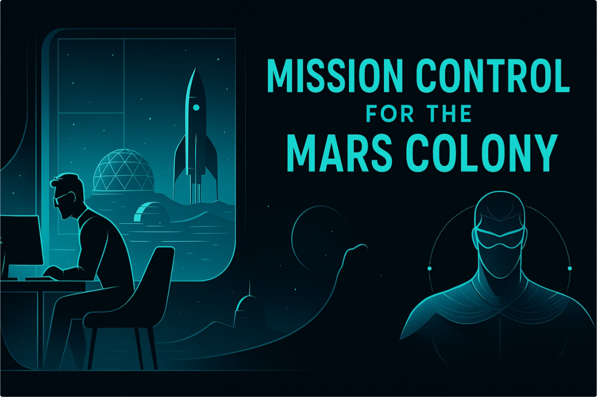
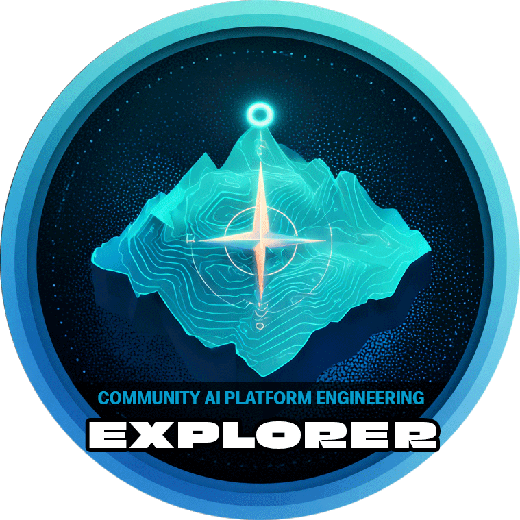
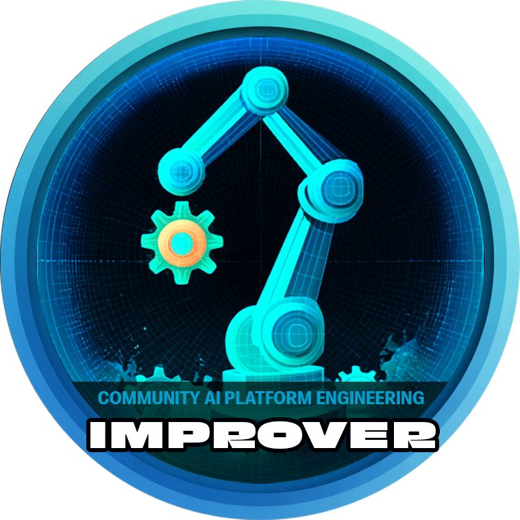
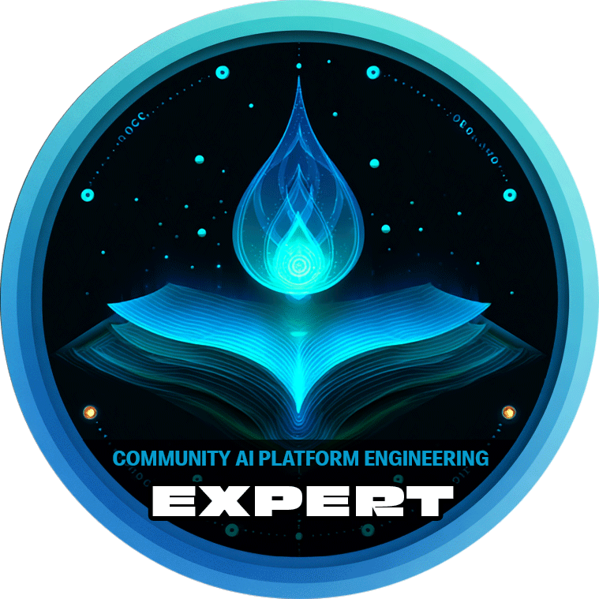
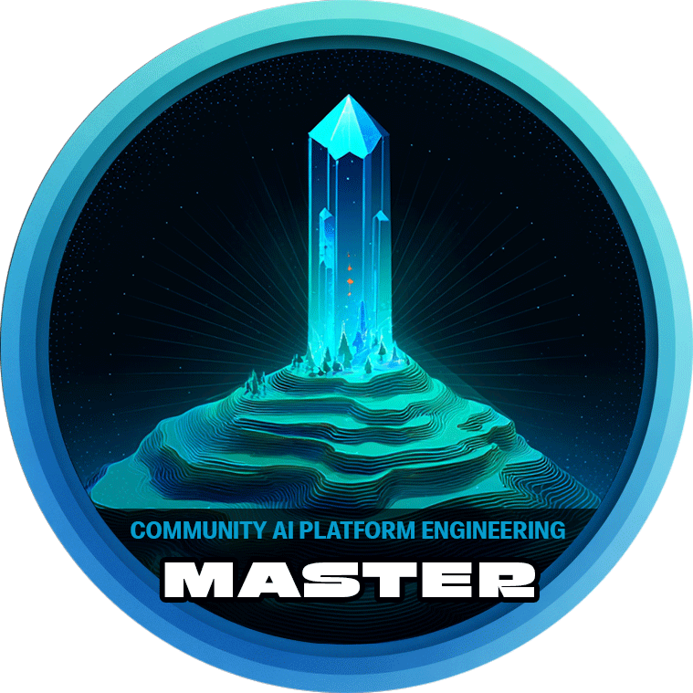

# Your Mission - Mission Control for Mars Colony

You and your team have landed on **Mars** 🟠 to establish **Mission Control operations with Agentic AI**. 📡🤖🚀

🎯 Your **mission** is to set up 🛰️ communication and 🌦️ weather monitoring systems so life in the new habitat runs smoothly, while staying connected to Earth 🌍 by reporting your findings. 📡

Along the way, you’ll complete a **series of Mission Checks**, each building on the last — starting with a single agent 🤖, then expanding to a distributed multi-agent system using A2A and MCP 🌐, and finally running CAIPE (Community AI Platform Engineering) MAS and interfacing using Backstage/CLI interface. 🖥️🛸

------------------------------

## 🧭 1. Mission Checks

- **Mission Check 1 — Download Mission and Learn the Controls** 🛰️📝

Clone the repo, set up prerequisites, and bring Mission Control online. 🚀

- **Mission Check 2 — Create Life** 🧬🤖
    - Run the **Petstore Agent** 🐾 and confirm your first AI agent is alive. 💡

- **Mission Check 3 — Scan the Skies** 🌌🌪️
    - Introduce the **Multi-Agent Mars Weather** system ☁️ to monitor dust storms. 🌫️

- **Mission Check 4 — Mission Control Manual (KB RAG)** 📚🧠
    - Launch the **Knowledge Base RAG system** 🗂️, ingest docs, and query them. 🔍

- **Mission Check 5 — Report Findings to Earth** 🌍📝
    - Use the **GitHub + Work Tracking Agent** 🐙📋 to write a combined report from Petstore, Weather, and RAG. 📨

- **Mission Check 6 — Assemble with idpbuilder** 🛠️📦
    - Package the full CAIPE stack into reproducible deployable bundles. 🎁

- **Mission Check 7 — Tracing and Evaluation** 🕵️‍♂️📊
    - Customize prompts, enable tracing, and evaluate agent workflows. 🧪

- **Mission Check 8 — Run CAIPE with AGNTCY SLIM** 🌐🤝
    - Deploy with AGNTCY integrations for production-like workflows. 🏭

## 🎯 2. Bonus Missions

* **AGNTCY Intro**
* **AGNTCY — Agent Directory**
* **AGNTCY — SLIM**
* **AGNTCY — Agent Identity**

## 🏁📢 3. We’ll conclude with **Final Debrief & Takeaways**

------------------------------

# 🏆 CAIPE Badges

- Everyone who participates in this workshop will receive the `Explorer` badge. You can proudly display this achievement badge on your Cisco Directory profile or on LinkedIn.
- After the workshop has concluded, we will send you and your manager a formal email confirming your participation in the CAIPE workshop.
- Future badges can be earned by continuing your learning progression, attending monthly office hours, participating in open source community meetings, and contributing to the CAIPE project.

More details about badges, progression, and the learning path can be found here:
[https://cisco.sharepoint.com/sites/CAIPE/SitePages/CAIPE-Digital-Badges.aspx](https://cisco.sharepoint.com/sites/CAIPE/SitePages/CAIPE-Digital-Badges.aspx)

| Badge Level        |   |   | Badge Image                                                                 |
|--------------------|---|---|-----------------------------------------------------------------------------|
| 🚀 CAIPE Explorer  |   |   |       |
| ⚡ CAIPE Improver  |   |   |       |
| 🎯 CAIPE Expert    |   |   |           |
| 👑 CAIPE Master    |   |   |           |