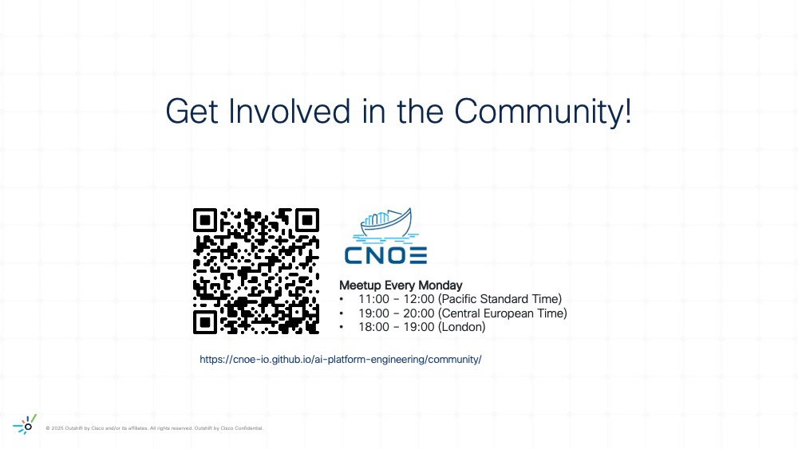

# Conclusion and Next Steps

Congratulations on completing your missions! 🚀 While our official journey wraps up here, the adventure continues—there are plenty of bonus exercises and ways to stay connected with the CAIPE community. 🌟

## Bonus Missions and Community Resources

- **✨ Bonus Exercise**
  - Explore the `Bonus: AGNTCY` mission

- **🌐 CAIPE Internal Cisco Webex Channel**
  - Join the conversation and connect with fellow explorers on our [AI Platform Engineering Community Webex Channel](https://eurl.io/#bOa9oXKAn).

- **📅 Office Hours & External Community Events**
  - Participate in our **CAIPE Cisco Month Office Hours** for live Q&A, troubleshooting, and networking with the CAIPE community.
  - Find the schedule and join links here: [CAIPE Office Hours](https://cisco.sharepoint.com/sites/CAIPE/SitePages/CAIPE-Office-Hours.aspx)

- **💬 Stay engaged with external community and join our weekly meeting**
  - For ongoing support, updates, and to connect with fellow participants, join our [CAIPE Community Slack Channel and Community Meetings](https://cnoe-io.github.io/ai-platform-engineering/community/).

- **📝 Feedback**
  - Share your feedback and suggestions to help us improve future workshops!
  - You will receive a survey email directly from Webex.

Thank you for being part of this journey! We hope to see you at future events and in the CAIPE community. Keep exploring, building, and collaborating! 🦸‍♂️🦸‍♀️🤖🌌

  

