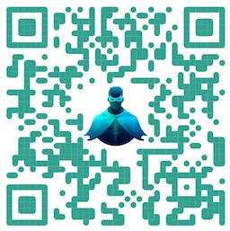

# Mission Check 1 — Start Ignition: Download Mission and Learn the Controls

<button onclick="createCountdown({duration: 10, target: 'timer1', doneText: 'FINISHED!', onComplete: () => alert('Timer complete!')}).start()">Start Mission 1 15 min timer</button>
<span id="timer1" class="timer">00:15</span>

## Clone CAIPE

Clone the CAIPE (Community AI Platform Engineering) repository

```bash
cd $HOME/work
```

```bash
pwd
```

```bash
git clone https://github.com/cnoe-io/ai-platform-engineering
```

&nbsp;

## 🌟 **Support CAIPE with stars!** 🌟
Scan the QR code below or visit the CAIPE repository.
<br>

<br>

_Link:_ [https://github.com/cnoe-io/ai-platform-engineering](https://github.com/cnoe-io/ai-platform-engineering)

_Please give us a ⭐️ on GitHub. Your support helps grow our community and keeps the project thriving. 🚀_

&nbsp;

## 📖🛰️ Download Mission Manual 🚀

* Navigate to CAIP Docs - [https://cnoe-io.github.io/ai-platform-engineering/](https://cnoe-io.github.io/ai-platform-engineering/)
<div style="background: #f8f9fa; padding: 20px; border-radius: 8px; border-left: 4px solid #007cba;">
  <h4 style="margin-top: 0; color: #007cba;">📖 Mission Manual Exploration Checklist</h4>

  <label style="display: block; margin: 10px 0; cursor: pointer;">
    <input type="checkbox" style="margin-right: 10px; transform: scale(1.2);">
    Explore <strong>Getting Started</strong> &rarr; <strong>Quick Start</strong>
  </label>

  <label style="display: block; margin: 10px 0; cursor: pointer;">
    <input type="checkbox" style="margin-right: 10px; transform: scale(1.2);">
    Explore <strong>Setup</strong> &rarr; <strong>Docker</strong> &rarr; <strong>Run with Docker Compose</strong>
  </label>

  <label style="display: block; margin: 10px 0; cursor: pointer;">
    <input type="checkbox" style="margin-right: 10px; transform: scale(1.2);">
    Explore <strong>Setup</strong> &rarr; <strong>IDP Builder</strong>
  </label>
</div>

## Agentic AI Concepts

Let's review some key concepts.

### What is an Agent?

An AI Agent is a system that uses a Large Language Model (LLM) to decide the flow of an application

### Anatomy of agent



### ReAct Loop

Reason and Act (ReAct) is a common
design pattern used in agentic systems to help LLMs decide the next action or tool to use


### What is a Multi-Agent System (MAS)?

A Multi-Agent System (MAS) is an agentic AI system composed of multiple, independent and interacting agents to achieve a common goal

Here are some example MAS architecture patterns:

### MAS Network/Swarm Architecture

MAS architecture where agents communitcate in a network like pub-sub, multi-cast or broadcast groups. Each agent is aware of and can hand-off to any other agent(s) in the group


### MAS Planner/Deep Agent Architecture

Simple ReAct agents can yield agents that are “shallow”. They are particularly not very good at longer running tasks, more complex tasks with mutli-turn conversations.

A class MAS systems called “Deep Research” agents implement a planner based architecture, to plan a set of tasks and invoke the sub-agents, system tools in combination with Human-in-the-loop. Examples: Claude Code, AWS Q Cli etc.


### MAS Supervisor Architecture

A supervisor agent orchestrates tasks with a bunch of sub-agents with the same system or over network


### MAS Hierarchical Supervisor Architecture

Supervisor of Supervisor agents


**References:**

* [Outshift blog - Deep dive into MAS](https://outshift.cisco.com/blog/architecting-jarvis-technical-deep-dive-into-its-multi-agent-system-design)
* [LangChain - Multi-agent systems](https://langchain-ai.github.io/langgraph/concepts/multi_agent/)
* [LangChain - Benchmarking Multi-Agent Architectures](https://blog.langchain.com/benchmarking-multi-agent-architectures/)

### CAPIE Architecture


## MCP (Model Context Protocol)

MCP (Model Context Protocol) standardizes how large language models (LLMs) can get application or API context such as tools, system prompts etc.


## Difference between an AI agent vs MCP server

Agentic Systems landscape is evolving rapidly, understanding the distinction between AI Agents and MCP Servers is crucial for building scalable agentic systems. While MCP Servers provide a standardized interface for tools and data sources, AI Agents leverage these capabilities to perform complex reasoning, planning, and execution tasks. As MCP protocol advances the lines are blurring, as of today, AI Agents are superset of what MCP server can do but some agents are directly exposed via MCP.

* [Agent Memory (Long-term and Short-term)](https://blog.langchain.com/memory-for-agents/)
* [Prompt/Context Engineering](https://blog.langchain.com/context-engineering-for-agents/)
* Agent Orchestration
* [Tool Pruning via RAG](https://github.com/langchain-ai/langgraph-bigtool)

**Reference blog:**

* [AI Agent vs MCP Server](https://cnoe-io.github.io/ai-platform-engineering/blog/ai-agent-vs-mcp-server)

## A2A Protocol

The Agent2Agent (A2A) Protocol is an open standard designed to enable seamless communication and collaboration between AI agents over the network.


## AGNTCY Collective

The AGNTCY project provides the complete infrastructure stack for agent collaboration—discovery, identity, messaging, and observability that works across any vendor or framework. It is the foundational layer that lets specialized agents find each other, verify capabilities, and work together on complex problems.


* [Agent Directory](https://docs.agntcy.org/dir/overview/)
  * [OASF Record](https://docs.agntcy.org/oasf/open-agentic-schema-framework/)
* [SLIM](https://docs.agntcy.org/messaging/slim-core/)
* [Agent Identity](https://docs.agntcy.org/messaging/slim-core/)
* [Agntcy App SDK](https://github.com/agntcy/app-sdk)
* [coffeeAgntcy](https://github.com/agntcy/coffeeAgntcy/tree/main)

**_Note: More bonus missions are available to try offline for a deeper dive into AGNTCY._**

**Reference:**

* [https://agntcy.org/](https://agntcy.org/)


<div style="background: #f8f9fa; padding: 20px; border-radius: 8px; border-left: 4px solid #28a745;">
  <h4 style="margin-top: 0; color: #28a745;">🚀 Mission 1 Checklist</h4>

  <label style="display: block; margin: 10px 0; cursor: pointer;">
    <input type="checkbox" style="margin-right: 10px; transform: scale(1.2);">
    <strong> Read the Mission Brief and CAIPE Overview</strong>
  </label>

  <label style="display: block; margin: 10px 0; cursor: pointer;">
    <input type="checkbox" style="margin-right: 10px; transform: scale(1.2);">
    <strong> Understand the CAIPE architecture diagram</strong>
  </label>

  <label style="display: block; margin: 10px 0; cursor: pointer;">
    <input type="checkbox" style="margin-right: 10px; transform: scale(1.2);">
    <strong> Review the MCP (Model Context Protocol) section</strong>
  </label>

  <label style="display: block; margin: 10px 0; cursor: pointer;">
    <input type="checkbox" style="margin-right: 10px; transform: scale(1.2);">
    <strong> Learn the difference between AI Agent and MCP Server</strong>
  </label>

  <label style="display: block; margin: 10px 0; cursor: pointer;">
    <input type="checkbox" style="margin-right: 10px; transform: scale(1.2);">
    <strong> Explore the A2A Protocol overview</strong>
  </label>

  <label style="display: block; margin: 10px 0; cursor: pointer;">
    <input type="checkbox" style="margin-right: 10px; transform: scale(1.2);">
    <strong> Review AGNTCY Collective and its components</strong>
  </label>

  <label style="display: block; margin: 10px 0; cursor: pointer;">
    <input type="checkbox" style="margin-right: 10px; transform: scale(1.2);">
    <strong> Visit at least one reference link for deeper understanding</strong>
  </label>
</div>
