# Mission Check 2 — Run Standalone Petstore Agent

## Overview

🚀 **Mission Status**: As a newly arrived Mars Inhabitant, your first assignment is to manage the colony's biological companions and supply systems.

In this mission, you'll deploy a standalone Petstore AI agent to handle critical colony operations:

* **🐾 Companion Management**: Track, care for, and manage colony animals that boost morale and assist with tasks
* **📦 Supply Operations**: Monitor inventory, process resource orders, and analyze colony logistics
* **👨‍🚀 Inhabitant Management**: Maintain records and manage access for fellow Mars inhabitants
* **🔍 Smart Search**: Efficiently locate animals and supplies using advanced filtering systems
* **⚡ Response Optimization**: Handle large datasets crucial for colony survival without system overload

## Architecture Overview

The petstore agent can run in two different MCP (Model Control Protocol) modes, each with distinct advantages:

### Key Differences Between the Modes

| Mode         | How it Works                                                                                                                                         | Benefits                                                                                                 |
|--------------|------------------------------------------------------------------------------------------------------------------------------------------------------|----------------------------------------------------------------------------------------------------------|
| 🔗 **STDIO** | The agent starts its own MCP server process and communicates directly through simple text commands (like a conversation through a pipe).             | - Faster communication (no network delays)<br>- Everything runs in one place<br>- Simpler setup for development<br>- No authentication needed |
| 🌐 **HTTP**  | The agent connects to a separate MCP server running elsewhere using web requests (like calling an API over the internet).                            | - MCP server can serve multiple agents<br>- Better for production deployments<br>- Can scale components independently<br>- Supports authentication and security |

The following diagrams illustrate how the chat client connects to the petstore agent in each mode:

| Mode        | Diagram                                                                                   |
|-------------|------------------------------------------------------------------------------------------|
| **STDIO**   |  <br>_Mission 2 Architecture - STDIO Mode_        |
| **HTTP**    |  <br>_Mission 2 Architecture - HTTP Mode_           |

## Step 1: Navigate to AI Platform Engineering Repository

```bash
cd $HOME/work/ai-platform-engineering
```

## Step 2: Set Up Environment Variables

### Copy the example environment file:

```bash
cp .env.example .env
```

### Edit the environment file with your LLM credentials:

**NOTE:** If you prefer to build and run the agent locally, refer to the step at the bottom of this page: [Optional: Build and run the petstore agent locally](#optional-build-and-run-the-petstore-agent-locally).

For this workshop, we will use Azure OpenAI. The api key has already been exported to the environment variables. Run below command in the terminal to copy the secrets in `.env_vars` file to `.env` file that you just created:

```bash
sed -i \
  -e 's|^LLM_PROVIDER=.*|LLM_PROVIDER=azure-openai|' \
  -e "s|^AZURE_OPENAI_API_KEY=.*|AZURE_OPENAI_API_KEY=${AZURE_OPENAI_API_KEY}|" \
  -e "s|^AZURE_OPENAI_ENDPOINT=.*|AZURE_OPENAI_ENDPOINT=${AZURE_OPENAI_ENDPOINT}|" \
  -e "s|^AZURE_OPENAI_DEPLOYMENT=.*|AZURE_OPENAI_DEPLOYMENT=${AZURE_OPENAI_DEPLOYMENT}|" \
  -e "s|^AZURE_OPENAI_API_VERSION=.*|AZURE_OPENAI_API_VERSION=${AZURE_OPENAI_API_VERSION}|" \
  .env
```

You can also check the variables have been set correctly in the `.env` file by going to the IDE tab on the top right of this page (`</>`) and locating the file under `ai-platform-engineering/` directory.

## Step 3: Run the Petstore Agent

You can run the petstore agent in two different MCP (Model Control Protocol) modes. For this workshop, we will use the STDIO mode.

### 3.1: Using MCP STDIO Mode

STDIO mode runs the MCP server embedded within the agent container, using standard input/output streams for internal communication. The embedded MCP server then connects to the external Petstore API.

```bash
IMAGE_TAG=latest MCP_MODE=stdio docker compose -f workshop/docker-compose.mission2.yaml up
```

**What happens:**

- ⏬ Downloads petstore agent image with the latest tag from the registry
- 🔗 Connects to MCP server via STDIO mode to https://petstore.swagger.io/v2 which is a public sandbox API
- 🌐 Exposes agent on `http://localhost:8000`
- 📋 Shows logs directly in terminal
- 🚀 **Advantage**: Lower latency, direct process communication

### [Optional] 3.2: Using Remote MCP Streamable HTTP Mode

HTTP mode enables network-based communication with remote MCP servers, useful for production deployments or when the MCP server is running separately. In this mode, the agent connects to a separately hosted internal MCP server running at https://petstore.outshift.io/mcp, which then handles the Petstore API operations.

#### Set the Petstore API key

```bash
PETSTORE_API_KEY=$(echo -n 'caiperocks' | sha256sum | cut -d' ' -f1) && \
sed -i "s|^PETSTORE_API_KEY=.*|PETSTORE_API_KEY=${PETSTORE_API_KEY}|" .env
```

#### Run the petstore agent

```bash
IMAGE_TAG=latest MCP_MODE=http docker compose -f workshop/docker-compose.mission2.yaml up
```

**What happens:**

- ⏬ Downloads petstore agent image with the latest tag from the registry
- 🌐 Connects to remote MCP server via HTTP/streaming mode at https://petstore.outshift.io/mcp
- 🌐 Exposes agent on `http://localhost:8000`
- 📋 Shows logs directly in terminal
- 🚀 **Advantage**: Supports remote MCP servers, useful for production deployments, better separation of concerns

### Expected Output (Both Modes)

Regardless of which mode you choose, you should see the following output:

```console
...
===================================
       PETSTORE AGENT CONFIG
===================================
AGENT_URL: http://0.0.0.0:8000
===================================
Running A2A server in p2p mode.
INFO:     Started server process [1]
INFO:     Waiting for application startup.
INFO:     Application startup complete.
INFO:     Uvicorn running on http://0.0.0.0:8000 (Press CTRL+C to quit)
```

**🎯 Success indicator:** Ensure you wait until you see the message: `Uvicorn running on http://0.0.0.0:8000 (Press CTRL+C to quit)` regardless of the mode you choose.

**💡 Mode Selection Tip:**
- Use **STDIO mode** for local development and testing with minimal overhead
- Use **HTTP mode** for production environments or when you need to connect to remotely hosted MCP servers

## Step 4: Test the Petstore Agent

### Test the agent health

Open a new terminal and run the following command to test the agent health:

```bash
curl http://localhost:8000/.well-known/agent.json | jq
```

You should see the agent card with petstore capabilities. This includes the agent's name, description, and capabilities including example prompts that you can use to test the agent.

## Step 5: Connect Chat Client

Once you confirm the agent is running, start the chat client:

**💡 Tip:**  When askes to `💬 Enter token (optional): `, press enter.

```bash
docker run -it --network=host ghcr.io/cnoe-io/agent-chat-cli:stable
```

The chat client will connect to the petstore agent on port 8000 and download the agent card from Step 4. It will then use the agent card to discover the agent's capabilities.

Wait for the agent's welcome message with example skills and CLI prompt `🧑🧑‍💻 You: `. You can now start interacting with the agent.

## Step 6: Interact with the Petstore Agent

### Discovery Commands

Try these example interactions:

```bash
What actions can you perform?
```

```bash
Show me what you can do with pets
```

### Pet Management Examples

```bash
Find all available pets in the store
```

```bash
Get all cats that are available
```

```bash
Get a summary of pets by status
```

```bash
I want to add a new pet to the store
```

**Warning:** The Petstore API used here (`https://petstore.swagger.io/v2`) is a public demo sandbox. Create/update/delete requests may return 200 OK but data is not persisted, so subsequent reads may not reflect your changes.

### Store Operations

```bash
Check store inventory levels
```

```bash
Show me pets with 'friendly' tags
```

### Expected Behavior

- ✅ **Fast responses** - Agent uses optimized functions with response limits
- ✅ **Smart search** - Can handle combined criteria like "cats that are pending"
- ✅ **Interactive guidance** - Agent will ask for required details when needed e.g. ask to add a new pet and it will ask for required details like name, category, status, etc.
- ✅ **Rich summaries** - Shows counts and statistics without overwhelming data

## Mission Checks


<div style="background: #f8f9fa; padding: 20px; border-radius: 8px; border-left: 4px solid #007cba;">
  <h4 style="margin-top: 0; color: #007cba;">🚀 Colony Mission Checklist</h4>

  <label style="display: block; margin: 10px 0; cursor: pointer;">
    <input type="checkbox" style="margin-right: 10px; transform: scale(1.2);">
    <strong> Navigate to AI Platform Engineering repository</strong>
  </label>

  <label style="display: block; margin: 10px 0; cursor: pointer;">
    <input type="checkbox" style="margin-right: 10px; transform: scale(1.2);">
    <strong> Set up .env file with LLM credentials</strong>
  </label>

  <label style="display: block; margin: 10px 0; cursor: pointer;">
    <input type="checkbox" style="margin-right: 10px; transform: scale(1.2);">
    <strong> Run docker compose to pull the latest petstore agent image and run it on port 8000</strong>
  </label>

  <label style="display: block; margin: 10px 0; cursor: pointer;">
    <input type="checkbox" style="margin-right: 10px; transform: scale(1.2);">
    <strong> Connect chat client to the petstore agent and test the agent</strong>
  </label>

  <label style="display: block; margin: 10px 0; cursor: pointer;">
    <input type="checkbox" style="margin-right: 10px; transform: scale(1.2);">
    <strong> Test discovery: "What actions can you perform?"</strong>
  </label>

  <label style="display: block; margin: 10px 0; cursor: pointer;">
    <input type="checkbox" style="margin-right: 10px; transform: scale(1.2);">
    <strong> Test companion search: "Find all available companions"</strong>
  </label>

  <label style="display: block; margin: 10px 0; cursor: pointer;">
    <input type="checkbox" style="margin-right: 10px; transform: scale(1.2);">
    <strong> Test smart search: "Get all cats that are pending"</strong>
  </label>

  <label style="display: block; margin: 10px 0; cursor: pointer;">
    <input type="checkbox" style="margin-right: 10px; transform: scale(1.2);">
    <strong> Test interactive: "I want to add a new companion"</strong>
  </label>
</div>

## Teardown that agent and chat client

You can stop the agent and chat client by pressing `Ctrl+C` (or `Cmd+C` on Mac) in each terminal.

## Troubleshooting

Here are some common issues you may encounter and how to fix them.

### Agent won't start
```bash
# Check if port 8000 is in use
lsof -i :8000

# Stop any existing containers
make stop
make clean
```

### Chat client can't connect
```bash
# Verify agent health
curl http://localhost:8000/.well-known/agent.json

# Check if agent is running
make status
```

### Environment issues
```bash
# Check environment variables
make show-env

# Rebuild with fresh environment
make run-rebuild
```

## [Optional] Build and run the petstore agent locally

### Set up environment variables

If you are using your local machine, first get the `AZURE_OPENAI_API_KEY` from the lab environment:

```bash
echo $AZURE_OPENAI_API_KEY
```

Then run below command in your local terminal to set up your environment variables. When asked to enter the API key, paste the value you just copied from the lab environment:

```bash
read -s -p "Enter your Azure OpenAI API key: " AZURE_OPENAI_API_KEY && echo && \
sed -i \
  -e 's|^LLM_PROVIDER=.*|LLM_PROVIDER=azure-openai|' \
  -e "s|^AZURE_OPENAI_API_KEY=.*|AZURE_OPENAI_API_KEY=${AZURE_OPENAI_API_KEY}|" \
  -e 's|^AZURE_OPENAI_ENDPOINT=.*|AZURE_OPENAI_ENDPOINT=${AZURE_OPENAI_ENDPOINT}|' \
  -e 's|^AZURE_OPENAI_DEPLOYMENT=.*|AZURE_OPENAI_DEPLOYMENT=${AZURE_OPENAI_DEPLOYMENT}|' \
  -e 's|^AZURE_OPENAI_API_VERSION=.*|AZURE_OPENAI_API_VERSION=${AZURE_OPENAI_API_VERSION}|' \
  .env
```

### Build and run the petstore agent locally

You can also build and run the petstore agent locally:

```bash
MCP_MODE=<stdio|http> docker compose -f workshop/docker-compose.mission2.yaml -f workshop/docker-compose.dev.override.yaml --profile mission2-dev up
```
**What happens:**

- 🔧 Builds Docker image located in `ai_platform_engineering/agents/template/build/Dockerfile.a2a`
- 📁 Mounts code via volumes for live development
- 🌐 Exposes agent on `http://localhost:8000`
- 📋 Shows logs directly in terminal

Above command uses the dev override file to mount the code from your local machine and rebuild the petstore agent image on each change. This is useful for testing local changes to the agent code. You can now return to [Step 4: Test the Petstore Agent](#step-4-test-the-petstore-agent) to test the agent.
