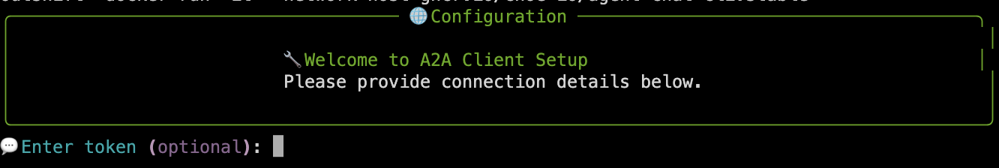

# Mission Check 3 — Multi-Agent Weather + Petstore System

<div style="display: flex; align-items: center; gap: 12px;">
  <button
    onclick="createCountdown({duration: 900, target: 'timer1', doneText: 'FINISHED!', onComplete: () => alert('Timer complete!')}).start()"
    style="
      background: linear-gradient(90deg, #007cba 0%, #28a745 100%);
      color: #fff;
      border: none;
      border-radius: 6px;
      padding: 8px 18px;
      font-size: 1.1em;
      font-weight: bold;
      cursor: pointer;
      box-shadow: 0 2px 8px rgba(0,0,0,0.08);
      transition: background 0.2s;
    "
    onmouseover="this.style.background='linear-gradient(90deg, #28a745 0%, #007cba 100%)'"
    onmouseout="this.style.background='linear-gradient(90deg, #007cba 0%, #28a745 100%)'"
  >
    🚀 Start Mission &mdash; 15 min Timer
  </button>
  <span id="timer1" class="timer" style="font-family: monospace; font-size: 1.1em; color: #011234;">15:00</span>
</div>

## Overview

In this mission, you'll run a **multi-agent system** that coordinates critical Mars colony operations across multiple domains:

- **🐾 Petstore Agent**: Manages colony biological companions from Mission 2 - essential for morale and psychological well-being during long Mars deployments
- **🌤️ Weather Agent**: Monitors weather conditions to optimize interplanetary trade routes and supply deliveries - knowing weather patterns helps predict launch windows and cargo capacity for supply missions
- **🧠 Supervisor Agent**: Acts as the colony's central command coordinator, orchestrating complex operations that require data from multiple specialized systems

### Architecture Overview

<div style="text-align: center;">

</div>

This demonstrates **agent-to-agent communication** where the supervisor can intelligently route requests to specialized agents and combine their responses.

## Step 1: Configure Multi-Agent Environment

<div style="border: 1px solid #17a2b8; border-left: 4px solid #17a2b8; background-color: #f0ffff; padding: 16px; margin: 16px 0; border-radius: 4px;">
<strong>💡 Tip:</strong> You can also click the IDE button on the top right of this page to open the `.env` file in the IDE and edit it that way. Edit lines 1-18 with the following agent configuration:
</div>

First, ensure you are in the correct directory:

```bash
cd $HOME/work/ai-platform-engineering
```

Run the below command to update the `.env` file with the following agent configuration:

```bash
sed -i \
  -e 's|^ENABLE_WEATHER_AGENT=.*|ENABLE_WEATHER_AGENT=true|' \
  -e 's|^ENABLE_PETSTORE_AGENT=.*|ENABLE_PETSTORE_AGENT=true|' \
  -e 's|^SKIP_AGENT_CONNECTIVITY_CHECK=.*|SKIP_AGENT_CONNECTIVITY_CHECK=false|' \
  -e 's|^AGENT_CONNECTIVITY_ENABLE_BACKGROUND=.*|AGENT_CONNECTIVITY_ENABLE_BACKGROUND=true|' \
  .env
```

<div style="border: 1px solid #17a2b8; border-left: 4px solid #17a2b8; background-color: #f0ffff; padding: 14px; margin: 16px 0; border-radius: 4px;">
  <strong>💡 Tip:</strong> Check if they are set in your .env
</div>

```bash
cat .env | grep -Ei 'weather|petstore|skip_agent|agent_connectivity' | sed -E 's/(=.{5}).+/\1****/'
```

The connectivity check is performed when the supervisor agent starts. It will check if the petstore and weather agents are running and if they are, it will add them to the supervisor agent's memory.

The dynamic monitoring is performed in the background and will check if the petstore and weather agents are running every 5 minutes. If any of the agents is unavailable, the supervisor agent will remove it from available tools until it is back online.

## Step 2: Start Multi-Agent System

---

### 2.1: Launch the multi-agent stack with Docker Compose:

For this mission, we will use the HTTP mode. You can also try out the STDIO mode afterward if you prefer.

**2.1.1: HTTP mode**

HTTP mode will connect petstore and weather agents to connect with their respective remote MCP servers that are hosted by Outshift at:

* `https://petstore.outshift.io/mcp`: mcp server containing data for the available pet companions from Earth

* `https://weather.outshift.io/mcp`: mcp server that can retrieve real weather data for Earth using the Open-Meteo API as well as mock weather data for Mars

```bash
IMAGE_TAG=latest MCP_MODE=http docker compose -f workshop/docker-compose.mission3.yaml --profile=p2p up
```

**2.1.2: What happens (Both modes)**

- ⏬ Downloads the latest supervisor, petstore and weather agent images from the registry
- 🌐 Exposes the supervisor agent on `http://localhost:8000`
- 🌐 Exposes the petstore agent on `http://localhost:8009`
- 🌐 Exposes the weather agent on `http://localhost:8010`
- 🔗 Uses peer-to-peer (p2p) mode to connect the supervisor agent to the petstore and weather agents
- 📋 Shows logs directly in terminal for all three agents

**2.1.4: Expected output:**

Look out for the following logs for each agent in a new terminal:

**Petstore agent logs:**

```bash
docker logs agent-petstore-p2p
```

```
...
agent-petstore-p2p     | ===================================
agent-petstore-p2p     |        PETSTORE AGENT CONFIG
agent-petstore-p2p     | ===================================
agent-petstore-p2p     | AGENT_URL: http://0.0.0.0:8000
agent-petstore-p2p     | ===================================
agent-petstore-p2p     | Running A2A server in p2p mode.
agent-petstore-p2p     | INFO:     Started server process [1]
agent-petstore-p2p     | INFO:     Waiting for application startup.
agent-petstore-p2p     | INFO:     Application startup complete.
agent-petstore-p2p     | INFO:     Uvicorn running on http://0.0.0.0:8000 (Press CTRL+C to quit)
```

**Weather agent logs:**

```bash
docker logs agent-weather-p2p
```

```
...
agent-weather-p2p      | ===================================
agent-weather-p2p      |        WEATHER AGENT CONFIG
agent-weather-p2p      | ===================================
agent-weather-p2p      | AGENT_URL: http://0.0.0.0:8000
agent-weather-p2p      | ===================================
agent-weather-p2p      | Running A2A server in p2p mode.
agent-weather-p2p      | INFO:     Started server process [1]
agent-weather-p2p      | INFO:     Waiting for application startup.
agent-weather-p2p      | INFO:     Application startup complete.
agent-weather-p2p      | INFO:     Uvicorn running on http://0.0.0.0:8000 (Press CTRL+C to quit)
```

**Supervisor agent logs:**

The supervisor agent logs can be quite verbose as it checks for up to 9 possible agents. Here's how to filter for the key success indicators:

```bash
docker logs platform-engineer-p2p 2>&1 | grep -F -B8 'Uvicorn running on http://0.0.0.0:8000'
```

This will show the logs from the start of the supervisor agent until the Uvicorn server is running like below:

```
...
platform-engineer-p2p  | 2025-08-21 13:36:04,058 - INFO - Dynamic monitoring enabled for 2 agents
platform-engineer-p2p  | 2025-08-21 13:36:04,062 - INFO - [LLM] AzureOpenAI deployment=gpt-4o api_version=2025-03-01-preview
platform-engineer-p2p  | 2025-08-21 13:36:04,809 - INFO - Graph updated with 2 agent tools
platform-engineer-p2p  | 2025-08-21 13:36:04,809 - INFO - AIPlatformEngineerMAS initialized with 2 agents
platform-engineer-p2p  | INFO:     Started server process [1]
platform-engineer-p2p  | INFO:     Waiting for application startup.
platform-engineer-p2p  | INFO:     Application startup complete.
platform-engineer-p2p  | INFO:     Uvicorn running on http://0.0.0.0:8000 (Press CTRL+C to quit)
```

<div style="border: 1px solid #28a745; border-left: 4px solid #28a745; background-color: #f8fff9; padding: 16px; margin: 16px 0; border-radius: 4px;">
<strong>🎯 Success indicator:</strong> Wait until you see all three agents running and the supervisor reports successful connectivity checks as shown in the logs above.
</div>

## Step 3: Test the agent health

---

We can now check each agent card to see what capabilities are available. Open a new terminal and run the following command to test the agent health:

### 3.1: Weather agent card

```bash
curl http://localhost:8009/.well-known/agent.json | jq
```

### 3.2: Petstore agent card

```bash
curl http://localhost:8010/.well-known/agent.json | jq
```

### 3.3: Supervisor agent card

This is the supervisor agent card. It will show the combined capabilities of the petstore and weather agents.

```bash
curl http://localhost:8000/.well-known/agent.json | jq
```

## Step 4: Connect Multi-Agent Chat Client

Once all agents are running, start the chat client:


```bash
docker run -it --network=host ghcr.io/cnoe-io/agent-chat-cli:stable
```

<div style="border: 1px solid #17a2b8; border-left: 4px solid #17a2b8; background-color: #f0ffff; padding: 16px; margin: 16px 0; border-radius: 4px;">
<strong>💡 Tip:</strong> When asked to <code>💬 Enter token (optional): </code>, just press enter ⏎.
<br><br>
<span style="font-size: 0.98em; color: #333;">
In production, your system will use a JWT or Bearer token for authentication here.
</span>
</div>



The client will connect to the supervisor agent and show available capabilities from both petstore and weather agents.

## Step 5: Test Multi-Agent Interactions

---

### 5.1: Discovery Commands

Try these to explore the multi-agent capabilities:

```bash
What agents are available?
```

```bash
What can you help me with?
```

### 5.2: Weather-Specific Commands

---

For Earth weather data, you can use the following commands:

```bash
What's the current weather in San Francisco?
```

```bash
Give me a 5-day forecast for London
```

For Mars weather data, you can use the following commands:

```bash
What regoins in Mars can you find the weather for?
```

```bash
What is the weather right now in Arabia Terra?
```

### 5.3: Petstore Commands (from Mission 2)

```bash
Get me all the available pets
```

```bash
Show me pets with 'Hot Climate Lover' tags
```

### 5.4: Cross-Agent Scenarios

Test scenarios that require both agents:

```bash
Is it going to rain in Tokyo tomorrow and also a summary of pets by status.
```

```bash
Considering the weather in Paris right now, what is the best pet available that I can adapt? First, get all the available pets and then based on the weather, provide the best pet recommendation.
```

```bash
What is the weather right now in Arabia Terra? Based on the weather, give me a pet that is suitable for the weather and explain why you chose that pet.
```

## Step 6: [Optional] Bonus 1: STDIO mode

<div style="border: 1px solid #ffc107; border-left: 4px solid #ffc107; background-color: #fffef0; padding: 16px; margin: 16px 0; border-radius: 4px;">
<strong>⚠️ Important:</strong> If you are already running agents in HTTP mode, first stop the docker compose before switching to STDIO mode:

```bash
docker compose -f $HOME/work/ai-platform-engineering/workshop/docker-compose.mission3.yaml --profile=p2p down
```
</div>

STDIO mode will connect petstore and weather agents to run the MCP server within the agents themselves.

* `http://localhost:8009/mcp`: mcp server containing data for the available pets retrieved from demo swagger API `https://petstore.swagger.io/v2`

* `http://localhost:8010/mcp`: mcp server that queries real weather data for Earth from the Open-Meteo API on `https://api.open-meteo.com/v1`

```bash
IMAGE_TAG=latest MCP_MODE=stdio docker compose -f workshop/docker-compose.mission3.yaml --profile=p2p up
```

## Step 7: [Optional] Bonus 2: AGNTCY SLIM Gateway

<div style="border: 1px solid #ffc107; border-left: 4px solid #ffc107; background-color: #fffef0; padding: 16px; margin: 16px 0; border-radius: 4px;">
<strong>⚠️ Important:</strong> If you are already running agents in HTTP mode, first stop the docker compose before switching to STDIO mode:

```bash
docker compose -f $HOME/work/ai-platform-engineering/workshop/docker-compose.mission3.yaml --profile=p2p down
```
</div>

<div style="border: 1px solid #007cba; border-left: 4px solid #007cba; background-color: #f0f8ff; padding: 16px; margin: 16px 0; border-radius: 4px;">
<strong>🌟 Bonus Challenge:</strong> Run this with AGNTCY SLIM Gateway in the middle
</div>

```bash
IMAGE_TAG=latest MCP_MODE=http docker compose -f workshop/docker-compose.mission3.yaml --profile=slim up
```

## Step 8: Teardown Multi-Agent System

<div style="border: 1px solid #dc3545; border-left: 6px solid #dc3545; background-color: #fff5f5; padding: 16px; margin: 16px 0; border-radius: 4px;">
  <strong>🛑 Before You Proceed: Bring Down Your Docker Containers</strong>
  <ul style="margin: 8px 0 0 16px;">
    <li><strong>Important:</strong> Run <code>docker compose down</code> in your terminal to stop and remove all running containers for this demo before moving on to the next steps.</li>
    <li>This ensures a clean environment and prevents port conflicts or resource issues.</li>
  </ul>
</div>

You can stop all agents by pressing `Ctrl+C` (or `Cmd+C` on Mac) in the terminal. Or if you have already closed the terminal, ensure you run the specific docker compose down command:

For p2p mode:

```bash
docker compose -f $HOME/work/ai-platform-engineering/workshop/docker-compose.mission3.yaml --profile=p2p down
```

For slim mode:

```bash
docker compose -f $HOME/work/ai-platform-engineering/workshop/docker-compose.mission3.yaml --profile=slim down
```

**Note**: Use the same `--profile` flag that you used when starting the agents.

## Mission Checks

---

<div style="background: #f8f9fa; padding: 20px; border-radius: 8px; border-left: 4px solid #007cba;">
  <h4 style="margin-top: 0; color: #007cba;">🚀 Mars Colony Multi-Agent Mission Checklist</h4>

  <label style="display: block; margin: 10px 0; cursor: pointer;">
    <input type="checkbox" style="margin-right: 10px; transform: scale(1.2);">
    <strong>Multi-Agent Launch: All three agents (supervisor, weather, petstore) start successfully</strong>
  </label>

  <label style="display: block; margin: 10px 0; cursor: pointer;">
    <input type="checkbox" style="margin-right: 10px; transform: scale(1.2);">
    <strong>Connectivity: Supervisor reports successful connections to both subagents</strong>
  </label>

  <label style="display: block; margin: 10px 0; cursor: pointer;">
    <input type="checkbox" style="margin-right: 10px; transform: scale(1.2);">
    <strong>Cross-Agent Query: Successfully handle requests requiring both weather and petstore data</strong>
  </label>

  <label style="display: block; margin: 10px 0; cursor: pointer;">
    <input type="checkbox" style="margin-right: 10px; transform: scale(1.2);">
    <strong>Agent Coordination: Observe supervisor routing requests to appropriate specialized agents</strong>
  </label>

  <label style="display: block; margin: 10px 0; cursor: pointer;">
    <input type="checkbox" style="margin-right: 10px; transform: scale(1.2);">
    <strong>Combined Responses: Receive unified answers that incorporate data from multiple agents</strong>
  </label>

  <label style="display: block; margin: 10px 0; cursor: pointer;">
    <input type="checkbox" style="margin-right: 10px; transform: scale(1.2);">
    <strong>Bonus: Run with AGNTCY SLIM Gateway</strong>
  </label>

  <label style="display: block; margin: 10px 0; cursor: pointer;">
    <input type="checkbox" style="margin-right: 10px; transform: scale(1.2);">
    <strong>Teardown: All agents are stopped</strong>
  </label>

</div>
