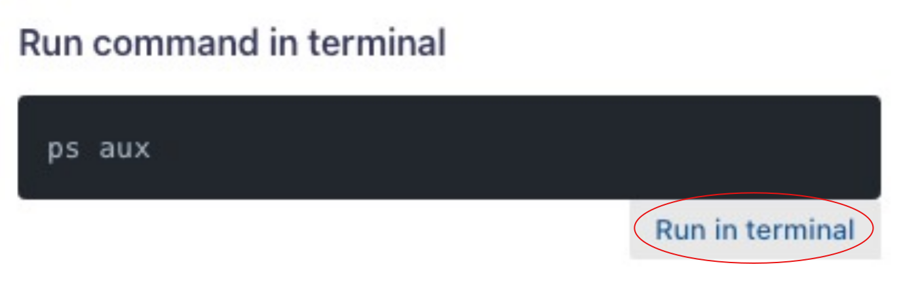

# Mission help

# 🛠️ Workshop Logistics & Support

- **🔍 Demo Lab Navigation**
  - Easily switch between the **Lab Guide**, **Terminal**, and **IDE** using the toggles in the **top right corner** of your screen.
  - Familiarize yourself with the interface before starting your missions for a smoother experience.

- **💻 Workspace Directory**
  - Your main workspace is located at: `/home/ubuntu/work`
  - Use the **IDE** toggle (top right) to access your files and code editor.
  - For terminal navigation, try using [`mc` - Midnight Commander](https://linuxcommand.org/lc3_adv_mc.php) (a visual file manager). Launch it in the terminal for a split-pane view.

- **🆘 Need Help?**
  - Raise your hand and chat with a workshop team member during the session so a team member can start a breakout session.
  - Click the **Mission Help** button (the last button on the mission navigation guide) at any time for mission assistance, troubleshooting tips, or to revisit these instructions.
  - For additional help, check out the [CAIPE FAQs](https://cisco.sharepoint.com/sites/CAIPE/SitePages/CAIPE-FAQs.aspx) for answers to common workshop and platform questions.

- **🤝 Breakout Sessions**
  - Each mission begins with a **3–5 minute explanation** from the instructor, followed by group breakout sessions for hands-on practice.
  - Breakout sessions are time-constrained, but if you need more time to complete a mission, just let your instructor know!
  - At the end of each breakout session, you will rejoin the main group for the next mission. Adjustments will be made to ensure everyone can keep up with the missions.

- **⏳ Lab Availability**
  - Your lab environment will remain active for **48 hours** after the workshop, until **EOD Friday (Pacific Time)**.
  - Please save your work and download any important files before your instance is terminated (as hosting VMs incurs costs).

- **📅 Office Hours & Community**
  - Join our **CAIPE Cisco Month Office Hours** for live Q&A, troubleshooting, and networking with the CAIPE community.
  - Find the schedule and join links here: [CAIPE Office Hours](https://cisco.sharepoint.com/sites/CAIPE/SitePages/CAIPE-Office-Hours.aspx)

- **💬 Stay Connected**
  - For ongoing support, updates, and to connect with fellow participants, join our [CAIPE Community Slack Channel and Community meetings](https://cnoe-io.github.io/ai-platform-engineering/community/).

- **📝 Feedback**
  - Share your feedback and suggestions to help us improve future workshops!
  - You will receive a survey email directly from Webex.

Let’s make this a fun and productive learning experience! 🚀✨
## Run command in terminal

Click on "Run in Terminal" button



```bash
ps aux
```

