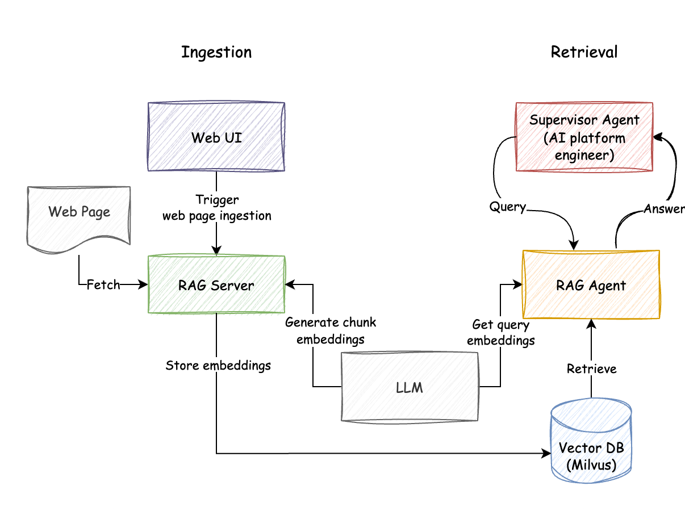
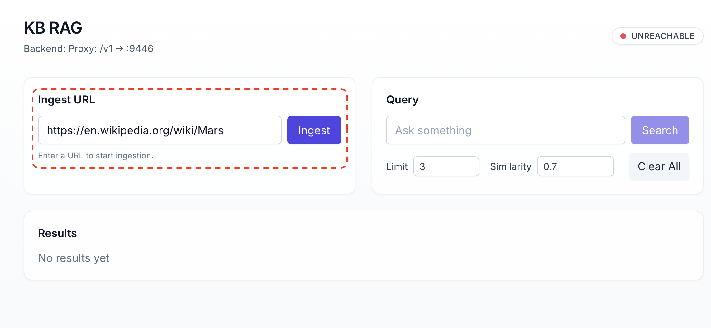
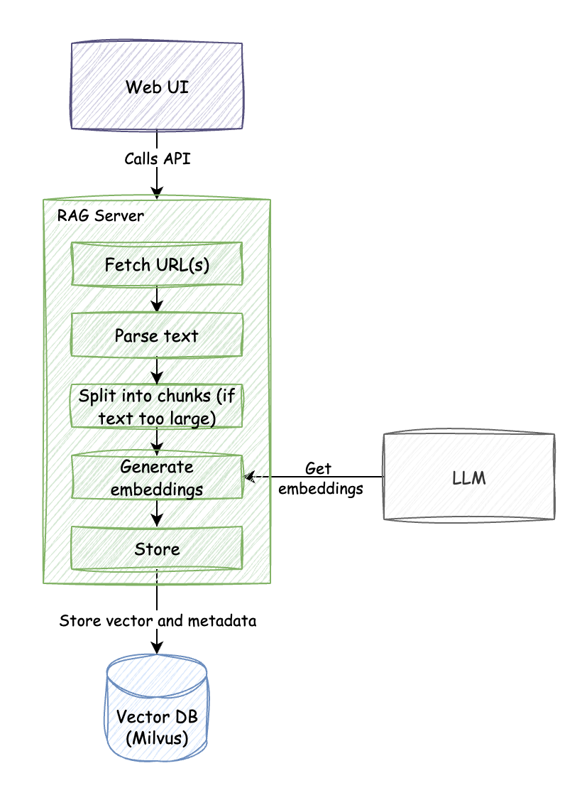
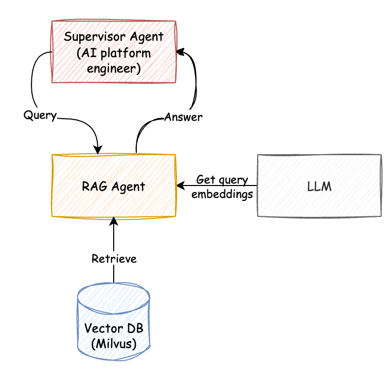

# Mission Check 4 - Reconnaissance & Reporting back (RAG + Git agent)

<div style="display: flex; align-items: center; gap: 12px;">
  <button
    onclick="createCountdown({duration: 900, target: 'timer1', doneText: 'FINISHED!', onComplete: () => alert('Timer complete!')}).start()"
    style="
      background: linear-gradient(90deg, #007cba 0%, #28a745 100%);
      color: #fff;
      border: none;
      border-radius: 6px;
      padding: 8px 18px;
      font-size: 1.1em;
      font-weight: bold;
      cursor: pointer;
      box-shadow: 0 2px 8px rgba(0,0,0,0.08);
      transition: background 0.2s;
    "
    onmouseover="this.style.background='linear-gradient(90deg, #28a745 0%, #007cba 100%)'"
    onmouseout="this.style.background='linear-gradient(90deg, #007cba 0%, #28a745 100%)'"
  >
    🚀 Start Mission &mdash; 15 min Timer
  </button>
  <span id="timer1" class="timer" style="font-family: monospace; font-size: 1.1em; color: #011234;">15:00</span>
</div>

<br>

## Overview
<br>
In this mission, you'll deploy and interact with specialized agents for **knowledge retrieval** and **version control**:

- **📚 RAG Agent**: Use Retrieval-Augmented Generation (RAG) to answer questions about Mars
- **🔧 Git Agent**: Automate git operations like commits, pushes, and repository management

The following diagram shows the architecture of the RAG system:

<br>



<br>
<hr>

## Step 1: Launch RAG + Git Agent Stack
<br>
Make sure you are in the ai-platform-engineering directory:

```bash
cd $HOME/work/ai-platform-engineering
```

Copy over the mission4 environment variables file:

```bash
cp $HOME/.env_vars .env.mission4
```

Start the Docker Compose stack that includes both RAG and Git agents:

```bash
docker compose -f $HOME/work/ai-platform-engineering/workshop/docker-compose.mission4.yaml up
```

<div style="border: 1px solid #17a2b8; border-left: 4px solid #17a2b8; background-color: #f0ffff; color: #117a8b; padding: 14px; margin: 16px 0; border-radius: 4px;">
  <strong>👀 Observe:</strong> You should see the following in the logs:
</div>


```console
...
platform-engineer-p2p  |        SLACK AGENT CONFIG      ====
platform-engineer-p2p  | ===================================
platform-engineer-p2p  | AGENT_URL: http://localhost:8000
platform-engineer-p2p  | ===================================
platform-engineer-p2p  | ===================================8000
platform-engineer-p2p  |        KB-RAG AGENT CONFIG      ===
platform-engineer-p2p  | ===================================
platform-engineer-p2p  | AGENT_URL: http://kb-rag-agent:8000
platform-engineer-p2p  | ===================================
platform-engineer-p2p  | 2025-08-26 12:03:18,817 - INFO - Running connectivity checks for 8 agents (max 4 attempts per agent)...
platform-engineer-p2p  |        SLACK AGENT CONFIG
platform-engineer-p2p  | ===================================
platform-engineer-p2p  | AGENT_URL: http://localhost:8000
platform-engineer-p2p  | ===================================
platform-engineer-p2p  | ===================================
platform-engineer-p2p  |        KB-RAG AGENT CONFIG
platform-engineer-p2p  | ===================================
platform-engineer-p2p  | AGENT_URL: http://kb-rag-agent:8000
platform-engineer-p2p  | ===================================
platform-engineer-p2p  | 2025-08-26 12:03:18,817 - INFO - Running connectivity checks for 8 agents (max 4 attempts per agent)...
kb-rag-agent           | INFO:     172.19.0.9:53190 - "GET /.well-known/agent.json HTTP/1.1" 200 OK
agent-github-p2p       | INFO:     172.19.0.9:47004 - "GET /.well-known/agent.json HTTP/1.1" 200 OK
platform-engineer-p2p  | 2025-08-26 12:03:18,895 - INFO - HTTP Request: GET http://kb-rag-agent:8000/.well-known/agent.json "HTTP/1.1 200 OK"
platform-engineer-p2p  | 2025-08-26 12:03:18,895 - INFO - HTTP Request: GET http://kb-rag-agent:8000/.well-known/agent.json "HTTP/1.1 200 OK"
platform-engineer-p2p  | 2025-08-26 12:03:18,895 - INFO - ✅ Agent kb-rag is reachable at http://kb-rag-agent:8000
platform-engineer-p2p  | 2025-08-26 12:03:18,896 - INFO - HTTP Request: GET http://agent-github-p2p:8000/.well-known/agent.json "HTTP/1.1 200 OK"
platform-engineer-p2p  | 2025-08-26 12:03:18,897 - INFO - ✅ Agent github is reachable at http://agent-github-p2p:8000
...
```

The docker-compose stack should start the following services:

- `platform-engineer-p2p` : The platform engineer supervisor agent
- `agent-github-p2p` : The git agent
- `kb-rag-agent` : The RAG agent
- `kb-rag-server` : The RAG server
- `kb-rag-web`: The RAG web UI
- `milvus-standalone`: The Milvus vector database
- `etcd`: Needed for Milvus
- `minio`: Needed for Milvus


<div style="border: 1px solid #ffc107; border-left: 4px solid #ffc107; background-color: #fffef0; padding: 14px; margin: 16px 0; border-radius: 4px;">
  <strong>🫸 Wait:</strong> Wait until this process is completed.
</div>

Once you see the logs above, you can verify the supervisor agent is healthy by checking the health endpoint.

<div style="border: 1px solid #007cba; border-left: 4px solid #007cba; background-color: #f0f8ff; color: #007cba; padding: 14px; margin: 16px 0; border-radius: 4px;">
  <strong>💡 Tip:</strong> You can open a new terminal by clicking the <strong>+</strong> button in your terminal window. This allows you to run commands in parallel without stopping your running services.
</div>


```bash
curl http://localhost:8000/.well-known/agent.json | jq
```

<div style="border: 1px solid #17a2b8; border-left: 4px solid #17a2b8; background-color: #f0ffff; color: #117a8b; padding: 14px; margin: 16px 0; border-radius: 4px;">
  <strong>👀 Observe:</strong> The response should be a JSON object (the A2A agent card). If you get an error, wait for a few seconds and try again. The agent might still be starting up.
</div>

<br>
<hr>

## Step 2: Populate RAG database
<br>
Now, we will populate the RAG with documentation. The docker-compose stack should have started the `kb-rag-web` service, which is the web ui
for the RAG server.

<a href="/" onclick="javascript:event.target.port=6100" target="_blank" style="display: inline-block; font-size: 1.2em; font-weight: bold; background: linear-gradient(90deg, #007cba 0%, #28a745 100%); color: #fff; padding: 12px 28px; border-radius: 8px; text-decoration: none; box-shadow: 0 2px 8px rgba(0,0,0,0.10); margin: 18px 0; text-align: center;">
  🚀 Open RAG Web UI
</a>

Once the RAG Web UI is open:

1. Copy the URL for Mars wiki page `https://en.wikipedia.org/wiki/Mars` and paste it in `Ingest URL` field
2. Click `Ingest` button
3. **🫸 Wait:** Wait for the ingestion to complete


<div style="border: 1px solid #17a2b8; border-left: 4px solid #17a2b8; background-color: #f0ffff; color: #117a8b; padding: 14px; margin: 16px 0; border-radius: 4px;">
  <strong>👀 Observe:</strong>
  <ul style="margin: 0 0 0 18px;">
    <li>The status in the RAG Web UI should show as <code>✅ Successfully processed 1 URL(s)</code>.</li>
    <li>Switch over to the terminal showing your <code>docker compose logs</code> and observe the <code>kb_rag</code> ingestion logs for details about the document processing.</li>
  </ul>
</div>



### Explanation:

Here's what happens:

 - The RAG server crawls webpage (it also supports sitemap), and fetches the page.
 - The HTML is parsed and content is extracted.
 - If the page is too large, it is split into chunks, using [Recursive Text Splitter](https://python.langchain.com/docs/how_to/recursive_text_splitter/).
 - Each chunk is sent to embedding model (LLM in this case) to generate embeddings.
 - The embeddings are stored in a vector store (Milvus), along with metadata (source, title, description etc).

<br>



<br>
<hr>

## Step 3: Verify RAG System is working
<br>
We will now use the UI to query the RAG system and verify it is working.

<a href="/" onclick="javascript:event.target.port=6100" target="_blank">Open RAG Web UI again</a>

**Type:** `Axial tilt` in the query box, then **Click:** `Search` button

<div style="border: 1px solid #17a2b8; border-left: 4px solid #17a2b8; background-color: #f0ffff; color: #117a8b; padding: 14px; margin: 16px 0; border-radius: 4px;">
  <strong>👀 Observe:</strong> The response should return relevant document chunks. The chunks may not be formatted in a way that is easy to read. As long as some document chunks are returned, the RAG system is working.
</div>

<br>
<hr>

## Step 4: Using the RAG Agent
<br>

<div style="border: 1px solid #007cba; border-left: 4px solid #007cba; background-color: #f0f8ff; color: #007cba; padding: 14px; margin: 16px 0; border-radius: 4px;">
  <strong>💡 Tip:</strong> You can open a new terminal by clicking the <strong>+</strong> button in your terminal window. This allows you to run commands in parallel without stopping your running services.
</div>

```bash
docker run -it --network=host ghcr.io/cnoe-io/agent-chat-cli:stable
```

<div style="border: 1px solid #17a2b8; border-left: 4px solid #17a2b8; background-color: #f0ffff; padding: 16px; margin: 16px 0; border-radius: 4px;">
<strong>💡 Tip:</strong> When asked to <code>💬 Enter token (optional): </code>, just press enter ⏎.
<br><br>
<span style="font-size: 0.98em; color: #333;">
In production, your system will use a JWT or Bearer token for authentication here.
</span>
</div>


This should open a CLI chat client. You can now interact with the supervisor agent.

**Ask the agent:**

```bash
What is the axial tilt of Mars?
```

<div style="border: 1px solid #17a2b8; border-left: 4px solid #17a2b8; background-color: #f0ffff; color: #117a8b; padding: 14px; margin: 16px 0; border-radius: 4px;">
  <strong>👀 Observe:</strong> The agent should respond with the axial tilt of Mars, and cite the source of the information.
</div>

### Explanation:

Here's what happens:

 - The RAG agent embeds the question using the same embedding model used to embed the documents.
 - The agent then uses the vector store to find the most similar documents.
 - The agent uses the retrieved document chunks to answer the question.

<br>



<br>
<hr>

## Step 5: Multi-agent interaction
<br>

Now, we will test the multi-agent interaction by asking the supervisor agent to:
 - search for information about Mars (reconnaissance)
 - commit the steps to git repository (report back).


In the CLI chat client, ask the agent:

```bash
Research and write a report on mars surface in markdown format, then commit/upload it as a markdown file named '%%LABNAME%%-report.md' with commit message "mars-surface-report" to repo https://github.com/outshiftcaipe/mission-mars-colony on the `main` branch.
```

<div style="border-left: 4px solid #007cba; background: #f0f8ff; color: #007cba; padding: 14px; margin: 16px 0; border-radius: 4px;">
  <strong>💡 Tip:</strong> Switch to your logs terminal to watch the agents collaborate.
</div>

<div style="border: 1px solid #17a2b8; border-left: 4px solid #17a2b8; background-color: #f0ffff; color: #17a2b8; padding: 14px; margin: 16px 0; border-radius: 4px;">
  <strong>👀 Observe:</strong> While the agent is working, in the first terminal tab, you should see the ai platform engineering supervisor agent delegate tasks to <code>kb-rag</code> and <code>github</code> agents. Please note that this step might take a bit of time as the agents go back and forth to figure out the task.
</div>


<div style="border: 1px solid #17a2b8; border-left: 4px solid #17a2b8; background-color: #f0ffff; color: #117a8b; padding: 14px; margin: 16px 0; border-radius: 4px;">
  <strong>👀 Observe:</strong> 
  Back in the CLI chat client, the agent should have:
  <ul style="margin: 0 0 0 18px;">
  <li>Created a report with name: <strong><code>%%LABNAME%%-report.md</code></strong></li>
  <li>Committed it to <a href="https://github.com/outshiftcaipe/mission-mars-colony" target="_blank">the workshop git repository</a> with commit message "mars-surface-report".</li>
  </ul>
</div>

### Explanation:

Here's what happens:

 - The supervisor agent determines what needs to be done, and delegates the tasks to the sub agents.
 - It first asks the RAG agent to search for information about Mars surface.
 - The RAG agent uses the vector store to find relavant information, and write a report.
 - The supervisor agent then asks the git agent to commit the report as a text file to the repository.

<br>
<hr>


## Final step: Tear down the mult-agent system

Run the following in one of the terminals:

<div style="border: 1px solid #007cba; border-left: 4px solid #007cba; background-color: #f0f8ff; color: #007cba; padding: 14px; margin: 16px 0; border-radius: 4px;">
  <strong>💡 Tip:</strong> You can open a new terminal by clicking the <strong>+</strong> button in your terminal window. This allows you to run commands in parallel without stopping your running services.
</div>

<div style="border: 1px solid #dc3545; border-left: 6px solid #dc3545; background-color: #fff5f5; padding: 16px; margin: 16px 0; border-radius: 4px;">
  <strong>🛑 Before You Proceed: Bring Down Your Docker Containers</strong>
  <ul style="margin: 8px 0 0 16px;">
    <li><strong>Important:</strong> Run <code>docker compose down</code> in your terminal to stop and remove all running containers for this demo before moving on to the next steps.</li>
    <li>This ensures a clean environment and prevents port conflicts or resource issues.</li>
  </ul>
</div>

```bash
docker compose -f $HOME/work/ai-platform-engineering/workshop/docker-compose.mission4.yaml down
```

Then close all the tabs that were opened for this mission.

<br>
<hr>

## Mission Checks
<br>

<div style="background: #f8f9fa; padding: 20px; border-radius: 8px; border-left: 4px solid #007cba;">
  <h4 style="margin-top: 0; color: #007cba;">🚀 Reconnaissance & Reporting Mission Checklist</h4>

  <label style="display: block; margin: 10px 0; cursor: pointer;">
    <input type="checkbox" style="margin-right: 10px; transform: scale(1.2);">
    <strong>Launch RAG + Git agent stack successfully</strong>
  </label>

  <label style="display: block; margin: 10px 0; cursor: pointer;">
    <input type="checkbox" style="margin-right: 10px; transform: scale(1.2);">
    <strong>Import Mars wiki into RAG</strong>
  </label>

  <label style="display: block; margin: 10px 0; cursor: pointer;">
    <input type="checkbox" style="margin-right: 10px; transform: scale(1.2);">
    <strong>Verify RAG queries return relevant documentation</strong>
  </label>

  <label style="display: block; margin: 10px 0; cursor: pointer;">
    <input type="checkbox" style="margin-right: 10px; transform: scale(1.2);">
    <strong>Connect chat client to supervisor agent</strong>
  </label>

  <label style="display: block; margin: 10px 0; cursor: pointer;">
    <input type="checkbox" style="margin-right: 10px; transform: scale(1.2);">
    <strong>Test knowledge retrieval: "What is the axial tilt of Mars?"</strong>
  </label>

  <label style="display: block; margin: 10px 0; cursor: pointer;">
    <input type="checkbox" style="margin-right: 10px; transform: scale(1.2);">
    <strong>Test multi-agent interaction: Documentation search + git operations</strong>
  </label>
</div>

<br>
<hr>

## 📖 Further Reading
<br>

### RAG Agent

More information on the RAG agent can be found [here](https://github.com/cnoe-io/ai-platform-engineering/tree/main/ai_platform_engineering/knowledge_bases/rag).

### Graph RAG

The AI platform engineering repository also includes **Graph RAG**, which uses Neo4J to create knowledge graphs from structured data (K8s objects, AWS resources).
See the [Graph RAG documentation](https://cnoe-io.github.io/ai-platform-engineering/knowledge_bases/graph_rag) for more details, and how to run it in your local environment.

### Unified Knowledge Base

Currently there is a open discussion on how to unify different RAG systems, and create a unified knowledge base thats specialized for AI platform engineering. Please follow the discussion [here](https://github.com/cnoe-io/ai-platform-engineering/discussions/196).

### Github agent

The Github agent can be used as is. Please refer to the [Github agent documentation](https://github.com/cnoe-io/ai-platform-engineering/tree/main/ai_platform_engineering/agents/github) for more details.

<br>
<hr>

## 🛠 Troubleshooting
<br>

### Port already in use

If you get a port already in use error from docker, you may still be running containers from previous missions. You can run `docker ps` to see what containers are running, and `docker stop <container_id>` to stop them. 

<div style="border: 1px solid #dc3545; border-left: 6px solid #dc3545; background-color: #fff5f5; padding: 16px; margin: 16px 0; border-radius: 4px;">
  <strong>🛑 Do not stop essential containers</strong>
  <ul style="margin: 8px 0 0 16px;">
    <li><strong>Important:</strong> DO NOT STOP containers with name <code>etilab</code>  and <code>localdev-control-plane</code>. These are needed to run the workshop. </li>
  </ul>
</div>

### Terminal refreshed and can't see logs

If your terminal refreshed and you can no longer see the docker compose logs:

```bash
docker compose -f $HOME/work/ai-platform-engineering/workshop/docker-compose.mission4.yaml logs -f --tail 50
```

If you want to see individual container logs, you can use:

```bash
docker logs agent-github-p2p
docker logs kb-rag-agent
docker logs kb-rag-server
docker logs kb-rag-web
docker logs platform-engineer-p2p
```

### Could not find message from source agent

If you see an error similar to this:

```
Could not find message from source agent github_tools_agent. Found names: {'platform_engineer_supervisor'} 
```

There might be an issue with the communication between the agents. Try restarting the docker-compose stack by running:

```bash
docker compose -f $HOME/work/ai-platform-engineering/workshop/docker-compose.mission4.yaml down
docker compose -f $HOME/work/ai-platform-engineering/workshop/docker-compose.mission4.yaml up
```

### General errors

If you have issues with any agents not responding properly, try the prompt again after a few seconds, or restart the docker-compose stack as shown above.
