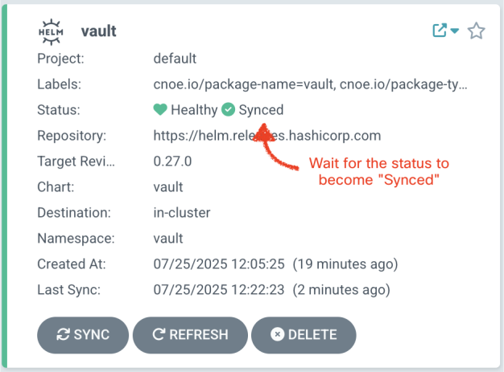

# Mission Check 6 — Deploy CAIPE (Community AI Platform Engineering) with IDPBuilder

<div style="display: flex; align-items: center; gap: 12px;">
  <button
    onclick="createCountdown({duration: 900, target: 'timer1', doneText: 'FINISHED!', onComplete: () => alert('Timer complete!')}).start()"
    style="
      background: linear-gradient(90deg, #007cba 0%, #28a745 100%);
      color: #fff;
      border: none;
      border-radius: 6px;
      padding: 8px 18px;
      font-size: 1.1em;
      font-weight: bold;
      cursor: pointer;
      box-shadow: 0 2px 8px rgba(0,0,0,0.08);
      transition: background 0.2s;
    "
    onmouseover="this.style.background='linear-gradient(90deg, #28a745 0%, #007cba 100%)'"
    onmouseout="this.style.background='linear-gradient(90deg, #007cba 0%, #28a745 100%)'"
  >
    🚀 Start Mission &mdash; 15 min Timer
  </button>
  <span id="timer1" class="timer" style="font-family: monospace; font-size: 1.1em; color: #011234;">15:00</span>
</div>


## Overview

🚀 **Mission Status**: Advanced Mars Inhabitant, you're now ready to deploy the full Community AI Platform Engineering stack to establish the colony's complete AI infrastructure.

In this mission, you'll deploy the comprehensive CAIPE platform using IDPBuilder to create a production-ready AI platform for the Mars colony:

- **🏗️ Platform Foundation**: Deploy ArgoCD, Vault, and Backstage as the core infrastructure
- **🔐 Security & Auth**: Configure Keycloak for single sign-on and Vault for secret management
- **🤖 AI Multi-Agent System**: Deploy the complete multi-agent orchestrator with specialized agents
- **📊 Developer Portal**: Access Backstage with integrated AI assistant capabilities
- **🌐 Service Mesh**: Configure ingress and networking for colony-wide access
- **⚡ Production Ready**: Create a versioned, reproducible platform deployment

For anyone going through the workshop on their own, you can also checkout our [vidcast](https://cnoe-io.github.io/ai-platform-engineering/getting-started/idpbuilder/setup) for a step by step guide on how to deploy the platform using IDPBuilder.

## 🚀 Deploy the Platform (Takes Time!)

**Run this command first since deployment takes several minutes, then read through the architecture while it deploys:**

```bash
idpbuilder create \
  --use-path-routing \
  --package https://github.com/cnoe-io/stacks//ref-implementation \
  --package https://github.com/suwhang-cisco/stacks//ai-platform-engineering
```

<div style="border: 1px solid #dc3545; border-left: 6px solid #dc3545; background-color: #fff5f5; padding: 16px; margin: 16px 0; border-radius: 4px;">
  <strong>⏰ Expected Output (Cluster Created, NOT Fully Deployed Yet)</strong>
  <p style="margin: 8px 0 0 0;">
    After the command completes, you should see output like the sample below. This confirms KIND cluster creation and that ArgoCD is reachable, <strong>but it does NOT mean the whole platform is deployed</strong>. ArgoCD will continue pulling images and bringing pods online, which typically takes <strong>5–10 minutes</strong>.
  </p>
</div>

```text
...
########################### Finished Creating IDP Successfully! ############################


Can Access ArgoCD at https://cnoe.localtest.me:8443/argocd
Username: admin
Password can be retrieved by running:

```bash
kubectl -n argocd get secret argocd-initial-admin-secret -o jsonpath='{.data.password}' | base64 -d; echo
```

<div style="border: 1px solid #dc3545; border-left: 6px solid #dc3545; background-color: #fff5f5; padding: 16px; margin: 16px 0; border-radius: 4px;">
  <strong>🚨 Massive Warning for Lab Environment Users</strong>
  <ul style="margin: 8px 0 0 16px;">
    <li><strong>Do NOT use</strong> <code>https://cnoe.localtest.me:8443/argocd</code> in the lab environment — that URL is only for local installs.</li>
    <li>Follow the steps below to set <code>&#36;LABURL</code> (Step 1) and then open ArgoCD using <code>https://&#36;LABURL:6101/argocd/</code> (Step 3.2).</li>
  </ul>
</div>

<a href="https://outshift-lab-d8n6400.demos.eticloud.io:6101/argocd" target="_blank" style="display: inline-block; font-size: 1.25em; font-weight: 600; background: #007cba; color: #fff; padding: 14px 28px; border-radius: 8px; text-decoration: none;">
  🚀 Open ArgoCD
</a>

This command will:

* Create a KIND cluster for the Mars colony platform
* Install core platform components (ArgoCD, Vault, Backstage)
* Deploy the complete CAIPE multi-agent system
* Configure ingress with path-based routing for colony access

## Architecture Overview

IDPBuilder is a CLI tool that creates a KIND cluster and deploys platform components via ArgoCD. The CAIPE stack adds authentication, secret management, and multi-agent AI capabilities:


### Component Flow

1. **IDPBuilder Initialization**: Creates KIND cluster and deploys ArgoCD + Gitea as foundation
2. **Platform Deployment**: ArgoCD deploys all platform components from Git repositories
3. **Authentication Setup**: Keycloak provides SSO for Backstage and other platform services
4. **Secret Management**: Vault stores secrets, External Secrets distributes to applications
5. **Developer Access**: NGINX Ingress routes traffic, Backstage provides developer portal
6. **AI Integration**: Agent-Forge plugin in Backstage connects to CAIPE MAS Agent
7. **Multi-Agent System**: Orchestrator manages individual agents for different platform domains

## Prerequisites (Local Machine Only)

If you are using your local machine, ensure you have the below prerequisites installed. For anyone using the lab environment for the workshop, the below prerequisites have been pre-installed for you.

- [kubectl](https://kubernetes.io/docs/tasks/tools/) installed and configured
- [IDPBuilder](https://cnoe.io/docs/idpbuilder/installation) binary installed
- Docker Desktop or similar container runtime running

## Step 1: Set Your Lab URL Environment Variable

**Set your lab URL so you can easily access all the services:**

The lab URL will be automatically detected from the lab environment details:

```bash
export LABURL=`head -n 3 /usr/share/etilabs/details | tail -1`
echo "Lab URL automatically set to: $LABURL"
```

## Step 2: Verify Colony Infrastructure

### Check cluster status

```bash
kubectl get nodes
```

### Verify all pods are running across the colony

```bash
kubectl get pods --all-namespaces
```

## Step 3: Access ArgoCD and Monitor Deployments

<div style="border-left: 4px solid #007cba; background: #f0f8ff; padding: 14px 18px; margin: 16px 0; border-radius: 6px;">
  <strong>📝 Note:</strong>
  <ul style="margin-top: 8px;">
    <li>
      <strong>Lab Environment:</strong>
      Use the URLs with your <span style="font-family: monospace; background: #e8eaf6; padding: 2px 4px; border-radius: 3px;">$LABURL</span> environment variable as shown below.
    </li>
    <li>
      <strong>Local Environment:</strong>
      Replace any <span style="font-family: monospace; background: #e8eaf6; padding: 2px 4px; border-radius: 3px;">https://$LABURL:6101</span> or <span style="font-family: monospace; background: #e8eaf6; padding: 2px 4px; border-radius: 3px;">https://$LABURL:6102</span> URLs with <span style="font-family: monospace; background: #e8eaf6; padding: 2px 4px; border-radius: 3px;">https://cnoe.localtest.me:8443</span> in all commands.
    </li>
  </ul>
</div>

<a href="https://outshift-lab-d8n6400.demos.eticloud.io:6101/argocd" target="_blank" style="display: inline-block; font-size: 1.25em; font-weight: 600; background: #007cba; color: #fff; padding: 14px 28px; border-radius: 8px; text-decoration: none;">
  🚀 Open ArgoCD
</a>

Once the cluster is created, IDPBuilder outputs the ArgoCD URL for monitoring your colony's platform deployment.

### 3.1: Get ArgoCD Administrative Access

First, extract admin credentials for the ArgoCD UI:

```bash
kubectl -n argocd get secret argocd-initial-admin-secret -o jsonpath='{.data.password}' | base64 -d; echo
```

### 3.2: Access ArgoCD to Monitor Platform Deployment

Open ArgoCD in your browser:

```bash
echo "Click this link to open ArgoCD: https://$LABURL:6101/argocd/"
```

### 3.3: Login to ArgoCD

Use the below credentials to login to ArgoCD:

- Username: `admin`
- Password: `<from step 3.1 above>`

Monitor application sync status. Initial synchronization takes 3-5 minutes as the colony platform comes online.

---

## Step 4: Configure Vault Secrets for Colony Operations

---

### 4.1: Check Vault application sync status

From the ArgoCD UI, you can monitor the sync status of the Vault application. Wait until the sync status is `Synced` for Vault like below:

**Note:** Vault will be on the 2nd page of the ArgoCD UI.



### 4.2: Port forward to Vault service

First, open up a **new terminal** and run the below command to port forward to Vault service so we can use this to directly access the vault service:

```bash
# Port forward Vault service (run in background)
kubectl port-forward -n vault svc/vault 8200:8200
```

### 4.3: Configure Vault CLI

Now, come back to the original terminal and run the below commands to configure the vault cli with the root token:

```bash
export VAULT_ADDR="http://localhost:8200"
export VAULT_TOKEN=$(kubectl get secret -n vault vault-root-token -o jsonpath='{.data.token}' | base64 -d)
vault login "$VAULT_TOKEN"
```

<a id="step-4-4"></a>
### 4.4: Verify Vault CLI is working and check existing secrets

Run below command to list existing secret paths:

```bash
vault kv list secret/ai-platform-engineering/
```

This should return a list of keys that exist in the `ai-platform-engineering` namespace:

```
Keys
----
argocd-secret
backstage-secret
github-secret
global
jira-secret
pagerduty-secret
slack-secret
```

which are pre-populated vault secret paths but the actual secrets are not populated yet.

### 4.5: Configure Global LLM Credentials

We will use the credentials from the `.env_vars` file you have been using for the workshop to populate the global LLM credentials:

```bash
source $HOME/.env_vars
vault kv put secret/ai-platform-engineering/global \
  LLM_PROVIDER=azure-openai \
  AZURE_OPENAI_API_KEY="${AZURE_OPENAI_API_KEY}" \
  AZURE_OPENAI_ENDPOINT="${AZURE_OPENAI_ENDPOINT}" \
  AZURE_OPENAI_DEPLOYMENT="${AZURE_OPENAI_DEPLOYMENT}" \
  AZURE_OPENAI_API_VERSION="${AZURE_OPENAI_API_VERSION}" \
  AWS_ACCESS_KEY_ID="" \
  AWS_SECRET_ACCESS_KEY="" \
  AWS_REGION="" \
  AWS_BEDROCK_MODEL_ID="" \
  AWS_BEDROCK_PROVIDER="" \
  OPENAI_API_KEY="" \
  OPENAI_ENDPOINT="" \
  OPENAI_MODEL_NAME=""
```

and now check this secret has been correctly stored in vault:

```bash
vault kv get secret/ai-platform-engineering/global
```

<div style="border: 1px solid #17a2b8; border-left: 4px solid #17a2b8; background-color: #f0ffff; padding: 16px; margin: 16px 0; border-radius: 4px;">
<strong>📝 Note:</strong> We support other LLM providers as well. Currently, we support Azure OpenAI, OpenAI, and AWS Bedrock. Check out our <a href="https://cnoe-io.github.io/ai-platform-engineering/getting-started/idpbuilder/setup#step-3-update-secrets">documentation</a> for more details.
</div>

### 4.6: Configure Agent-Specific Secrets

As you saw in [Step 4.4](#step-4-4), we have several sub-agents configured to work in this platform. For this workshop, we will only use a subset of the agents, but if you have personal credentials for other agents, feel free to populate the secrets for those agents as well.

**4.5.1: GitHub Agent**

Github token has already been configured in the `.env_vars` file you have been using for the workshop. Now, we will populate the github-secret in vault:

```bash
vault kv put secret/ai-platform-engineering/github-secret \
  GITHUB_PERSONAL_ACCESS_TOKEN="${GITHUB_PERSONAL_ACCESS_TOKEN}"
```

Verify the github-secret has been correctly stored in vault:

```bash
vault kv get secret/ai-platform-engineering/github-secret
```

**4.5.2: ArgoCD Agent**

First open a new terminal and port forward the ArgoCD service:

```bash
kubectl port-forward -n argocd svc/argocd-server 8080:80
```

Then now we will populate:

```bash
export ARGOCD_TOKEN=$(kubectl -n argocd get secret argocd-initial-admin-secret -o jsonpath='{.data.password}' | base64 -d)
vault kv put secret/ai-platform-engineering/argocd-secret \
  ARGOCD_API_URL="http://localhost:8080" \
  ARGOCD_VERIFY_SSL="false" \
  ARGOCD_TOKEN="${ARGOCD_TOKEN}"
```

Verify the argocd-secret has been correctly stored in vault:

```bash
vault kv get secret/ai-platform-engineering/argocd-secret
```

**4.5.3: [Optional] Configure other agents**

For the remaining agents (Backstage, Jira, PagerDuty, Slack), you can populate their secrets using the same approach if you have credentials for those services. To see what keys each agent requires, first examine their placeholder secrets in Vault:

```bash
vault kv get secret/ai-platform-engineering/$AGENT_NAME-secret
```

Then, you can populate the secrets in the same way as the github and argocd agents:

```
vault kv put secret/ai-platform-engineering/$AGENT_NAME-secret \
  <key1>=<value1> \
  <key2>=<value2> \
  ...
```

### 4.6: Refresh Colony Secrets

First, we need to force the secret refresh across the colony:

```bash
kubectl delete secret --all -n ai-platform-engineering
```

Once deleted, external secrets manager will automatically re-create the secrets with the latest values. Run below command to verify that the secrets have been re-created:

```bash
kubectl get secrets -n ai-platform-engineering
```

Then, we need to restart the agent pods to pick up the new secrets:

```bash
kubectl delete pod --all -n ai-platform-engineering
```

## Step 4: Access Colony Developer Portal (Backstage)

---

### Lab reset: Reinitialize Postgres and Backstage

Due to the lab environment and snapshotting, we'll reset Postgres data and restart Backstage so it re-initializes with the password in `backstage-env-vars`:

```bash
# Namespace
NS=backstage

# Scale Postgres down
kubectl -n $NS scale sts/postgresql --replicas=0

# Capture PV name and delete PVC (wipes DB data)
PV=$(kubectl -n $NS get pvc data-postgresql-0 -o jsonpath='{.spec.volumeName}')
kubectl -n $NS delete pvc data-postgresql-0

# If PV reclaim policy is Retain, delete the PV as well
kubectl get pv "$PV" -o jsonpath='{.spec.persistentVolumeReclaimPolicy}'; echo
kubectl delete pv "$PV" || true

# Scale Postgres up (re-initializes with POSTGRES_* from backstage-env-vars)
kubectl -n $NS scale sts/postgresql --replicas=1
kubectl -n $NS rollout status sts/postgresql

# Restart Backstage to connect to fresh DB
kubectl -n $NS rollout restart deploy/backstage
kubectl -n $NS rollout status deploy/backstage
```

### Get Colony Portal Credentials

Run the below command to get the colony user credentials:

```bash
idpbuilder get secrets | grep USER_PASSWORD | sed 's/.*USER_PASSWORD=\([^,]*\).*/\1/'
```

### Login to Colony Developer Portal

Open Backstage in your browser:

```bash
echo "Click this link to open Backstage: https://$LABURL:6101/"
```

Then login with:

- Username: `user1`
- Password: `<from the command above>`

## Step 5: Activate Colony AI Assistant

Once logged into the Developer Portal:

1. 🤖 Look for the AI agent icon in the bottom-right corner
2. 🚀 Click to open the colony AI assistant
3. 💬 Start interacting with the multi-agent platform engineering system

Try these colony operations:

```bash
What can you do?
```

If you have pagerduty secrets configured, you can also ask:

```bash
Who is on call right now?
```

If you have jira secrets configured, you can also ask:

```bash
Show me existing projects in Jira.
```

Feel free to ask anything else and experiment with the multi-agent system!

## Useful URLs

Run the below commands to open the various colony services in your browser:

```bash
echo "Click this link to open ArgoCD: https://$LABURL:6101/argocd/"
echo "Click this link to open Gitea: https://$LABURL:6101/gitea/"
echo "Vault accessible via kubectl port-forward on localhost:8200"
echo "Click this link to open Backstage: https://$LABURL:6101/"
echo "Click this link to open Keycloak: https://$LABURL:6101/keycloak/admin/master/console/"
```

## Step 6: Tear down the colony platform

<div style="border: 1px solid #dc3545; border-left: 6px solid #dc3545; background-color: #fff5f5; padding: 16px; margin: 16px 0; border-radius: 4px;">
  <strong>🛑 Before You Proceed: Tear Down Your KIND Cluster</strong>
  <ul style="margin: 8px 0 0 16px;">
    <li><strong>Important:</strong> Run <code>kind delete cluster --name localdev</code> in your terminal to delete the KIND cluster and clean up all platform resources before moving on to the next steps.</li>
    <li>This ensures a clean environment and frees up system resources.</li>
  </ul>
</div>

```bash
kind delete cluster --name localdev
```

## Mission Checks

<div style="background: #f8f9fa; padding: 20px; border-radius: 8px; border-left: 4px solid #007cba;">
  <h4 style="margin-top: 0; color: #007cba;">🚀 Colony Platform Deployment Checklist</h4>

  <label style="display: block; margin: 10px 0; cursor: pointer;">
    <input type="checkbox" style="margin-right: 10px; transform: scale(1.2);">
    <strong>✅ Verify prerequisites (kubectl, IDPBuilder) are installed</strong>
  </label>

  <label style="display: block; margin: 10px 0; cursor: pointer;">
    <input type="checkbox" style="margin-right: 10px; transform: scale(1.2);">
    <strong>🏗️ Deploy KIND cluster with CAIPE platform using IDPBuilder</strong>
  </label>

  <label style="display: block; margin: 10px 0; cursor: pointer;">
    <input type="checkbox" style="margin-right: 10px; transform: scale(1.2);">
    <strong>📊 Access ArgoCD and verify all applications are synced</strong>
  </label>

  <label style="display: block; margin: 10px 0; cursor: pointer;">
    <input type="checkbox" style="margin-right: 10px; transform: scale(1.2);">
    <strong>🔐 Configure Vault with LLM credentials and agent secrets</strong>
  </label>

  <label style="display: block; margin: 10px 0; cursor: pointer;">
    <input type="checkbox" style="margin-right: 10px; transform: scale(1.2);">
    <strong>🏠 Access Backstage developer portal with colony credentials</strong>
  </label>

  <label style="display: block; margin: 10px 0; cursor: pointer;">
    <input type="checkbox" style="margin-right: 10px; transform: scale(1.2);">
    <strong>🤖 Activate AI assistant in Backstage and test multi-agent capabilities</strong>
  </label>

  <label style="display: block; margin: 10px 0; cursor: pointer;">
    <input type="checkbox" style="margin-right: 10px; transform: scale(1.2);">
    <strong>🌐 Verify all colony endpoints are accessible and functional</strong>
  </label>

  <label style="display: block; margin: 10px 0; cursor: pointer;">
    <input type="checkbox" style="margin-right: 10px; transform: scale(1.2);">
    <strong>🚀 Test platform agent interactions: "What agents are available?"</strong>
  </label>

  <label style="display: block; margin: 10px 0; cursor: pointer;">
    <input type="checkbox" style="margin-right: 10px; transform: scale(1.2);">
    <strong>"Teardown" the colony platform</strong>
  </label>

</div>

## Troubleshooting

### IDPBuilder Deployment Issues

```bash
# Check IDPBuilder logs
idpbuilder get logs

# Verify KIND cluster status
kind get clusters
kubectl cluster-info
```

### Platform Applications Not Syncing

```bash
# Check ArgoCD application status
kubectl get applications -n argocd

# Force sync specific application
argocd app sync <application-name>
```

### Vault Secret Issues

```bash
# Check Vault pod status
kubectl get pods -n vault

# Verify secret creation
kubectl get secrets -n ai-platform-engineering
```

### AI Agent Connection Problems

```bash
# Check agent pod logs
kubectl logs -n ai-platform-engineering -l app=multi-agent

# Restart agent pods
kubectl delete pod --all -n ai-platform-engineering
```
