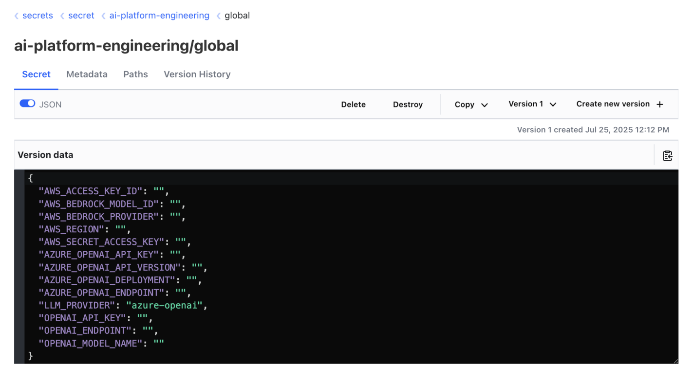

# Mission Check 6 — Deploy CAIPE (Community AI Platform Engineering) with IDPBuilder

## Overview

🚀 **Mission Status**: Advanced Mars Inhabitant, you're now ready to deploy the full Community AI Platform Engineering stack to establish the colony's complete AI infrastructure.

In this mission, you'll deploy the comprehensive CAIPE platform using IDPBuilder to create a production-ready AI platform for the Mars colony:

- **🏗️ Platform Foundation**: Deploy ArgoCD, Vault, and Backstage as the core infrastructure
- **🔐 Security & Auth**: Configure Keycloak for single sign-on and Vault for secret management
- **🤖 AI Multi-Agent System**: Deploy the complete multi-agent orchestrator with specialized agents
- **📊 Developer Portal**: Access Backstage with integrated AI assistant capabilities
- **🌐 Service Mesh**: Configure ingress and networking for colony-wide access
- **⚡ Production Ready**: Create a versioned, reproducible platform deployment

## Architecture Overview

IDPBuilder is a CLI tool that creates a KIND cluster and deploys platform components via ArgoCD. The CAIPE stack adds authentication, secret management, and multi-agent AI capabilities:


### Component Flow

1. **IDPBuilder Initialization**: Creates KIND cluster and deploys ArgoCD + Gitea as foundation
2. **Platform Deployment**: ArgoCD deploys all platform components from Git repositories
3. **Authentication Setup**: Keycloak provides SSO for Backstage and other platform services
4. **Secret Management**: Vault stores secrets, External Secrets distributes to applications
5. **Developer Access**: NGINX Ingress routes traffic, Backstage provides developer portal
6. **AI Integration**: Agent-Forge plugin in Backstage connects to CAIPE MAS Agent
7. **Multi-Agent System**: Orchestrator manages individual agents for different platform domains

## Prerequisites

For anyone using the lab environment for the workshop, the below prerequisites have been pre-installed for you. If you are using your local machine, ensure you have:

- [kubectl](https://kubernetes.io/docs/tasks/tools/) installed and configured
- [IDPBuilder](https://cnoe.io/docs/idpbuilder/installation) binary installed
- Docker Desktop or similar container runtime running

## Step 1: Create KIND Cluster with IDPBuilder

### Deploy the Complete Platform

```bash
idpbuilder create \
  --use-path-routing \
  --package https://github.com/cnoe-io/stacks//ref-implementation \
  --package https://github.com/suwhang-cisco/stacks//ai-platform-engineering
```

This command will:

* Create a KIND cluster for the Mars colony platform
* Install core platform components (ArgoCD, Vault, Backstage)
* Deploy the complete CAIPE multi-agent system
* Configure ingress with path-based routing for colony access

⏰ **Colony Deployment Time**: This takes a few minutes. Perfect time to review your mission objectives or checkout our [vidcast](https://cnoe-io.github.io/ai-platform-engineering/getting-started/idpbuilder/setup) on going through the IDPBuilder step by step ☕

## Step 2: Verify Colony Infrastructure

### Check cluster status

```bash
kubectl get nodes
```

### Verify all pods are running across the colony
```bash
kubectl get pods --all-namespaces
```

## Step 2: Access ArgoCD and Monitor Deployments

Once the cluster is created, IDPBuilder outputs the ArgoCD URL for monitoring your colony's platform deployment.

### Get ArgoCD Administrative Access

```bash
# Extract admin credentials for platform oversight
idpbuilder get secrets -p argocd
```

### Access Colony Platform Dashboard

Open https://cnoe.localtest.me:8443/argocd/ and login with:

- Username: `admin`
- Password: `<from the command above>`

Monitor application sync status. Initial synchronization takes 3-5 minutes as the colony platform comes online.

## Step 3: Configure Vault Secrets for Colony Operations

### Check Vault application sync status

From the ArgoCD UI, you can monitor the sync status of the Vault application.


### Extract Vault Administrative Token

After Vault application syncs successfully on ArgoCD, you can extract the root token for colony secret management:

```bash
kubectl get secret vault-root-token -n vault -o jsonpath="{.data}" | \
  jq -r 'to_entries[] | "\(.key): \(.value | @base64d)"'
```

### Access Colony Vault Interface

Open https://vault.cnoe.localtest.me:8443/ and login with the root token from the previous step.

### Configure Colony AI Agent Secrets

1. Navigate to `secrets/ai-platform-engineering` in Vault UI: https://vault.cnoe.localtest.me:8443/ui/vault/secrets/secret/kv/list/ai-platform-engineering/

2. **Configure Global LLM Settings** for colony AI operations:

   The `global` secret is required and contains LLM provider configuration shared across all agents. For this workshop, we will use Azure OpenAI. Run below command to get our LLM credentials from the lab environment:

   ```bash
   echo "LLM_PROVIDER: azure-openai"
   echo "AZURE_OPENAI_API_KEY: $AZURE_OPENAI_API_KEY"
   echo "AZURE_OPENAI_ENDPOINT: $AZURE_OPENAI_ENDPOINT"
   echo "AZURE_OPENAI_DEPLOYMENT: $AZURE_OPENAI_DEPLOYMENT"
   echo "AZURE_OPENAI_API_VERSION: $AZURE_OPENAI_API_VERSION"
   ```

   You can copy and paste the output to the `global` secret in the Vault UI.

   

   **NOTE:** We support other LLM providers as well. Currently, we support Azure OpenAI, OpenAI, and AWS Bedrock. Check out our [documentation](https://cnoe-io.github.io/ai-platform-engineering/getting-started/idpbuilder/setup#step-3-update-secrets) for more details.

3. **Configure Agent-Specific Secrets**: For each specialized agent (GitHub, PagerDuty, Jira), populate their respective secrets with required credentials.

4. **Refresh Colony Secrets**:

First, we need to force the secret refresh across the colony:

```bash
kubectl delete secret --all -n ai-platform-engineering
```

Then, we need to restart the agent pods to pick up the new secrets:

```bash
kubectl delete pod --all -n ai-platform-engineering
```

## Step 4: Access Colony Developer Portal (Backstage)

### Get Colony Portal Credentials

Run the below command to get the colony user credentials:

```bash
idpbuilder get secrets | grep USER_PASSWORD | sed 's/.*USER_PASSWORD=\([^,]*\).*/\1/'
```

### Login to Colony Developer Portal

Open https://cnoe.localtest.me:8443/ and login with:

- Username: `user1`
- Password: `<from the command above>`

## Step 5: Activate Colony AI Assistant

Once logged into the Developer Portal:

1. 🤖 Look for the AI agent icon in the bottom-right corner
2. 🚀 Click to open the colony AI assistant
3. 💬 Start interacting with the multi-agent platform engineering system

Try these colony operations:

```bash
What can you do?
```

If you have pagerduty secrets configured, you can also ask:

```bash
Who is on call right now?
```

If you have jira secrets configured, you can also ask:

```bash
Show me existing projects in Jira.
```

Feel free to ask anything else and experiment with the multi-agent system!

## Colony Communication Endpoints

Your Mars colony platform is now accessible at these coordinates:

- **🎯 ArgoCD** (Platform Operations): https://cnoe.localtest.me:8443/argocd/
- **🏠 Backstage** (Developer Portal): https://cnoe.localtest.me:8443/
- **🔐 Vault** (Secret Management): https://vault.cnoe.localtest.me:8443/
- **👤 Keycloak** (Identity Management): https://cnoe.localtest.me:8443/keycloak/admin/master/console/
- **📚 Gitea** (Code Repository): https://cnoe.localtest.me:8443/gitea/

## Step 6: Tear down the colony platform

```bash
kind delete cluster --name localdev
```

## Mission Checks

<div style="background: #f8f9fa; padding: 20px; border-radius: 8px; border-left: 4px solid #007cba;">
  <h4 style="margin-top: 0; color: #007cba;">🚀 Colony Platform Deployment Checklist</h4>

  <label style="display: block; margin: 10px 0; cursor: pointer;">
    <input type="checkbox" style="margin-right: 10px; transform: scale(1.2);">
    <strong>✅ Verify prerequisites (kubectl, IDPBuilder) are installed</strong>
  </label>

  <label style="display: block; margin: 10px 0; cursor: pointer;">
    <input type="checkbox" style="margin-right: 10px; transform: scale(1.2);">
    <strong>🏗️ Deploy KIND cluster with CAIPE platform using IDPBuilder</strong>
  </label>

  <label style="display: block; margin: 10px 0; cursor: pointer;">
    <input type="checkbox" style="margin-right: 10px; transform: scale(1.2);">
    <strong>📊 Access ArgoCD and verify all applications are synced</strong>
  </label>

  <label style="display: block; margin: 10px 0; cursor: pointer;">
    <input type="checkbox" style="margin-right: 10px; transform: scale(1.2);">
    <strong>🔐 Configure Vault with LLM credentials and agent secrets</strong>
  </label>

  <label style="display: block; margin: 10px 0; cursor: pointer;">
    <input type="checkbox" style="margin-right: 10px; transform: scale(1.2);">
    <strong>🏠 Access Backstage developer portal with colony credentials</strong>
  </label>

  <label style="display: block; margin: 10px 0; cursor: pointer;">
    <input type="checkbox" style="margin-right: 10px; transform: scale(1.2);">
    <strong>🤖 Activate AI assistant in Backstage and test multi-agent capabilities</strong>
  </label>

  <label style="display: block; margin: 10px 0; cursor: pointer;">
    <input type="checkbox" style="margin-right: 10px; transform: scale(1.2);">
    <strong>🌐 Verify all colony endpoints are accessible and functional</strong>
  </label>

  <label style="display: block; margin: 10px 0; cursor: pointer;">
    <input type="checkbox" style="margin-right: 10px; transform: scale(1.2);">
    <strong>🚀 Test platform agent interactions: "What agents are available?"</strong>
  </label>
</div>

## Troubleshooting

### IDPBuilder Deployment Issues

```bash
# Check IDPBuilder logs
idpbuilder get logs

# Verify KIND cluster status
kind get clusters
kubectl cluster-info
```

### Platform Applications Not Syncing

```bash
# Check ArgoCD application status
kubectl get applications -n argocd

# Force sync specific application
argocd app sync <application-name>
```

### Vault Secret Issues

```bash
# Check Vault pod status
kubectl get pods -n vault

# Verify secret creation
kubectl get secrets -n ai-platform-engineering
```

### AI Agent Connection Problems

```bash
# Check agent pod logs
kubectl logs -n ai-platform-engineering -l app=multi-agent

# Restart agent pods
kubectl delete pod --all -n ai-platform-engineering
```