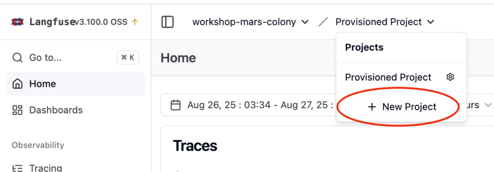
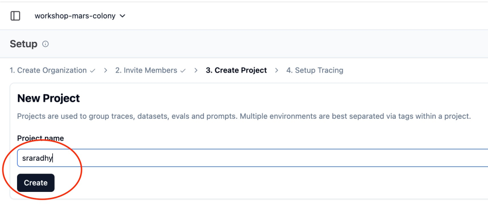
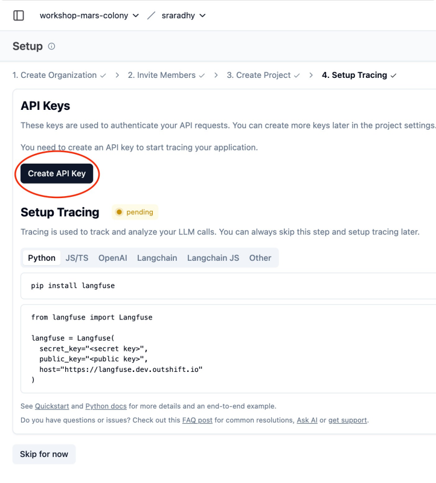
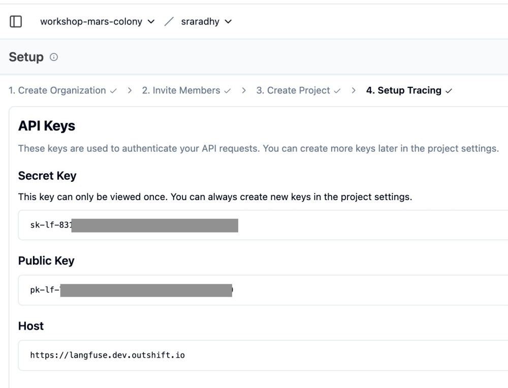
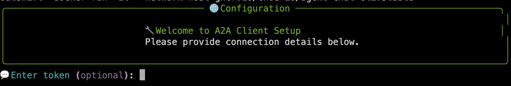

# Mission Check 7 — Tracing and Evaluation

<div style="display: flex; align-items: center; gap: 12px;">
  <button
    onclick="createCountdown({duration: 900, target: 'timer1', doneText: 'FINISHED!', onComplete: () => alert('Timer complete!')}).start()"
    style="
      background: linear-gradient(90deg, #007cba 0%, #28a745 100%);
      color: #fff;
      border: none;
      border-radius: 6px;
      padding: 8px 18px;
      font-size: 1.1em;
      font-weight: bold;
      cursor: pointer;
      box-shadow: 0 2px 8px rgba(0,0,0,0.08);
      transition: background 0.2s;
    "
    onmouseover="this.style.background='linear-gradient(90deg, #28a745 0%, #007cba 100%)'"
    onmouseout="this.style.background='linear-gradient(90deg, #007cba 0%, #28a745 100%)'"
  >
    🚀 Start Mission &mdash; 15 min Timer
  </button>
  <span id="timer1" class="timer" style="font-family: monospace; font-size: 1.1em; color: #011234;">15:00</span>
</div>

In this mission, you’ll enable tracing with Langfuse and observe your app’s behavior end-to-end.

Steps:

## 1. Log in to Langfuse

<a href="https://langfuse.dev.outshift.io/" target="_blank" style="display: inline-block; font-size: 1em; font-weight: 500; background: #007cba; color: #fff; padding: 6px 14px; border-radius: 5px; text-decoration: none; margin: 10px 0;">
  🚀 Click to open Langfuse
</a>

   - Login to <https://langfuse.dev.outshift.io/>
       - **Email:**
       ```
       workshop@outshift.io
       ```
       - **Password:**
        ```
        workshop-mars-colony
        ```

## 2. Create an API key

   - In the Langfuse UI, create a new project with your username.
       
       - 
   - Create API Key.
       - 
   - Copy both the Secret and Public keys.
       - 

## 3. Configure your environment

- Change directory to `/home/ubuntu/work`
```bash
cd $HOME/work
```

- Clone repo
```bash
git clone https://github.com/cnoe-io/ai-platform-engineering
```

- Change directory to repo
```bash
cd $HOME/work/ai-platform-engineering
```

<div style="border: 1px solid #007cba; border-left: 4px solid #007cba; background-color: #f0f8ff; color: #007cba; padding: 14px; margin: 16px 0; border-radius: 4px;">
  <strong>💡 Note:</strong>
  <ul style="margin: 8px 0 0 18px;">
    <li>Update <code>.env</code> file with Langfuse API secrets.</li>
  </ul>
</div>

- Copy `.env.example` to `.env` if the file doesn't exist or is empty
```bash
if [ ! -f .env ] || [ ! -s .env ]; then
  cp .env.example .env
fi
```

- Copy credentials from bash `env` to `.env` file
```bash
source $HOME/.env_vars && \
sed -i \
  -e 's|^LLM_PROVIDER=.*|LLM_PROVIDER=azure-openai|' \
  -e "s|^AZURE_OPENAI_API_KEY=.*|AZURE_OPENAI_API_KEY=${AZURE_OPENAI_API_KEY}|" \
  -e "s|^AZURE_OPENAI_ENDPOINT=.*|AZURE_OPENAI_ENDPOINT=${AZURE_OPENAI_ENDPOINT}|" \
  -e "s|^AZURE_OPENAI_DEPLOYMENT=.*|AZURE_OPENAI_DEPLOYMENT=${AZURE_OPENAI_DEPLOYMENT}|" \
  -e "s|^AZURE_OPENAI_API_VERSION=.*|AZURE_OPENAI_API_VERSION=${AZURE_OPENAI_API_VERSION}|" \
  -e "s|^GITHUB_PERSONAL_ACCESS_TOKEN=.*|GITHUB_PERSONAL_ACCESS_TOKEN=${GITHUB_PERSONAL_ACCESS_TOKEN}|" \
  .env
```

- Check environment variable (partially masked)
```bash
cat .env | grep -Ei 'azure|github|langfuse' | sed -E 's/(=.{5}).+/\1****/'
```

- Setup Langfuse environment variables
```bash
# Define key-value pairs
declare -A ENV_VARS=(
  ["ENABLE_TRACKING"]="true"
  ["LANGFUSE_TRACING_ENABLED"]="True"
  ["LANGFUSE_HOST"]="https://langfuse.dev.outshift.io"
)

# Update or append each key
for KEY in "${!ENV_VARS[@]}"; do
  VALUE="${ENV_VARS[$KEY]}"
  if grep -q "^${KEY}=" .env; then
    sed -i "s|^${KEY}=.*|${KEY}=${VALUE}|" .env
  else
    echo "${KEY}=${VALUE}" >> .env
  fi
done
```

- Setup LANGFUSE_SECRET_KEY
```bash
# LANGFUSE_SECRET_KEY
read -s -p "Enter your LANGFUSE_SECRET_KEY (pasted text won't show, just press enter): " LF_SEC_KEY; echo
export LANGFUSE_SECRET_KEY="$LF_SEC_KEY"
if grep -q "^LANGFUSE_SECRET_KEY=" .env; then
  sed -i "s|^LANGFUSE_SECRET_KEY=.*|LANGFUSE_SECRET_KEY=$LF_SEC_KEY|" .env
else
  echo "LANGFUSE_SECRET_KEY=$LF_SEC_KEY" >> .env
fi
```

- Setup LANGFUSE_PUBLIC_KEY
```bash
# LANGFUSE_PUBLIC_KEY
read -s -p "Enter your LANGFUSE_PUBLIC_KEY (pasted text won't show, just press enter): " LF_PUB_KEY; echo
export LANGFUSE_PUBLIC_KEY="$LF_PUB_KEY"
if grep -q "^LANGFUSE_PUBLIC_KEY=" .env; then
  sed -i "s|^LANGFUSE_PUBLIC_KEY=.*|LANGFUSE_PUBLIC_KEY=$LF_PUB_KEY|" .env
else
  echo "LANGFUSE_PUBLIC_KEY=$LF_PUB_KEY" >> .env
fi
```

- Check environment variable (partially masked)
```bash
cat .env | grep -Ei 'azure|github|langfuse' | sed -E 's/(=.{5}).+/\1****/'
```

## 4. Start Mission 7 services

**Run:**

```bash
IMAGE_TAG=latest ENABLE_TRACING=true LANGFUSE_SECRET_KEY=$LANGFUSE_SECRET_KEY LANGFUSE_PUBLIC_KEY=$LANGFUSE_PUBLIC_KEY LANGFUSE_HOST=https://langfuse.dev.outshift.io LANGFUSE_TRACING_ENABLED=True docker compose -f workshop/docker-compose.mission7.yaml up -d
```

```bash
docker compose -f workshop/docker-compose.mission7.yaml logs -f
```

## 5. Run the chat CLI and make an example query

**Run:**

<div style="border: 1px solid #007cba; border-left: 4px solid #007cba; background-color: #f0f8ff; color: #007cba; padding: 14px; margin: 16px 0; border-radius: 4px;">
  <strong>💡 Tip:</strong> You can open a new terminal by clicking the <strong>+</strong> button in your terminal window. This allows you to run commands in parallel without stopping your running services.
</div>

```bash
docker run -it --network=host ghcr.io/cnoe-io/agent-chat-cli:stable
```

<div style="border: 1px solid #17a2b8; border-left: 4px solid #17a2b8; background-color: #f0ffff; padding: 16px; margin: 16px 0; border-radius: 4px;">
<strong>💡 Tip:</strong> When asked to <code>💬 Enter token (optional): </code>, just press enter ⏎.
<br><br>
<span style="font-size: 0.98em; color: #333;">
In production, your system will use a JWT or Bearer token for authentication here.
</span>
</div>



- Ask a question:

```bash
What's the weather in london?
```

```bash
show my github info
```

```bash
How is the weather in San Jose? and tabule github activity in cnoe-io org and compare it with 5 day forecast
```

## 6. View the trace in Langfuse

<a href="https://langfuse.dev.outshift.io/" target="_blank" style="display: inline-block; font-size: 1.2em; font-weight: bold; background: linear-gradient(90deg, #007cba 0%, #28a745 100%); color: #fff; padding: 12px 28px; border-radius: 8px; text-decoration: none; box-shadow: 0 2px 8px rgba(0,0,0,0.10); margin: 18px 0; text-align: center;">
  🚀 Open Langfuse Observability Dashboard
</a>

   - Return to the Langfuse dashboard.
   - Open Traces and find the new trace for your query.
   - Explore the spans, inputs/outputs, and timing.

<div style="background: #f8f9fa; padding: 20px; border-radius: 8px; border-left: 4px solid #007cba;">
  <h4 style="margin-top: 0; color: #007cba;">✅ Success Criteria Checklist</h4>

  <label style="display: block; margin: 10px 0; cursor: pointer;">
    <input type="checkbox" style="margin-right: 10px; transform: scale(1.2);">
    You can see a complete, versioned trace for your query in Langfuse.
  </label>

  <label style="display: block; margin: 10px 0; cursor: pointer;">
    <input type="checkbox" style="margin-right: 10px; transform: scale(1.2);">
    Your environment is configured for reproducible tracing during development.
  </label>
</div>


## 7. Tear down

<div style="border: 1px solid #dc3545; border-left: 6px solid #dc3545; background-color: #fff5f5; padding: 16px; margin: 16px 0; border-radius: 4px;">
  <strong>🛑 Before You Proceed: Bring Down Your Docker Containers</strong>
  <ul style="margin: 8px 0 0 16px;">
    <li><strong>Important:</strong> Run <code>docker compose down</code> in your terminal to stop and remove all running containers for this demo before moving on to the next steps.</li>
    <li>This ensures a clean environment and prevents port conflicts or resource issues.</li>
  </ul>
</div>

```bash
cd $HOME/work/ai-platform-engineering && docker compose -f workshop/docker-compose.mission7.yaml down
```