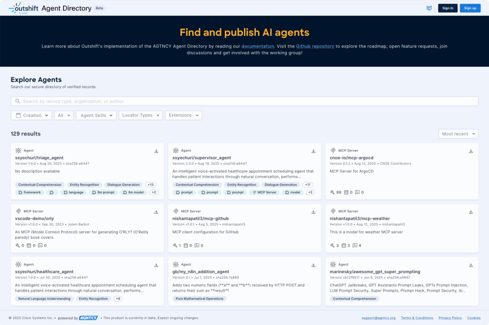
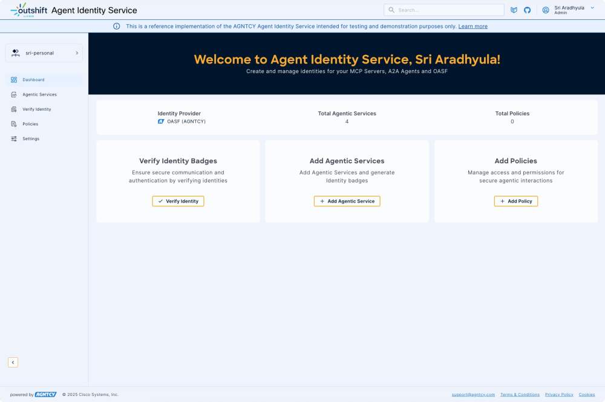

# AGNTCY

## AGNTCY Intro

The AGNTCY is where we are building the Internet of Agents to be: A diverse, collaborative space to innovate, develop, and maintain software components and services for agentic workflows and multi-agent software.


[Agntcy Docs](https://docs.agntcy.org/)


## Agent Directory

Allows announcing and discover agents or multi-agent applications which are described using OASF. Any organization can run its directory and keep it in sync with others, forming the Internet of Agents inventory. Agent Directory supports A2A agent cards, ACP agent manifests, and MCP server descriptions among other data models.

[https://agent-directory.outshift.com/explore](https://agent-directory.outshift.com/explore)


## OASF (Open Agent Schema Framework) - Agent record

Open Agent Schema Framework (OASF): An OCI based extensible data model allowing to describe agents' attributes and ensuring unique identification of agents. OASF supports the description of A2A agents, MCP servers and can be extended to support other popular formats, such as Copilot agent manifests and many more. Current OASF repo can be found here, OASF schema documentation can be found here.

**Tip:** Publish your Agent Record to Outshift Agent Directory using [https://docs.agntcy.org/dir/hosted-agent-directory/](https://docs.agntcy.org/dir/hosted-agent-directory/)




## AGNTCY SLIM (Secure Low-latency Interactive Messaging):

A protocol that defines the standards and guidelines for secure and efficient network-level communication between AI agents. SLIM ensures interoperability and seamless data exchange by specifying message formats, transport mechanisms, and interaction patterns.

## AGNTCY - Agent Identity

A system that leverages decentralized technologies to manage and verify the identities of Agents or Tools issued by any organization, ensuring secure and trustworthy interactions.

[https://agent-identity.outshift.com/dashboard](https://agent-identity.outshift.com/dashboard)



## Coffee Agntcy - Reference app

<center>
  
</center>


CoffeeAgntcy is a reference implementation based on a fictitious coffee company to help developers understand how components in the AGNTCY Internet of Agents ecosystem can work together. It gives examples of the components of AGNTCY working together as a Multi-agent System (MAS).

[Project Link](https://github.com/agntcy/coffeeAgntcy)

## Corto

A two-agent, ready-to-run setup that highlights core agent interactions using agent-to-agent (A2A) messaging via configurable transports(default: AGNTCY's SLIM). Agents are orchestrated within a LangGraph. It also shows how to enable observability using Observe SDK.

### Try it yourself: Run Corto

The Corto demo demonstrates the integration of an A2A client within a LangGraph workflow with an A2A server agent. It models a simplified agent system that acts as a coffee sommelier.

The Exchange Agent acts as a client interface, receiving prompts from the user interface about coffee flavor profiles and forwarding them to the farm agent.

The Farm Agent serves as a backend flavor profile generator, processing incoming requests and returning descriptive output.

The user interface forwards all prompts to the exchange’s API, which are then given to a LangGraph which contains an A2A client node. This A2A client node connects to the farm’s A2A server. The underlying A2A transport layer is fully configurable. By default, the system uses AGNTCY's SLIM.

```bash
cd $HOME/work
```

```bash
git clone https://github.com/agntcy/coffeeAgntcy
```

```bash
cd $HOME/work/coffeeAgntcy/coffeeAGNTCY/coffee_agents/corto
```

```bash
pwd
```

```bash
export LABURL=`head -n 3 /usr/share/etilabs/details | tail -1`
export VITE_EXCHANGE_APP_API_URL=$LABURL:6104
```

```bash
sed -i "s|VITE_EXCHANGE_APP_API_URL=http://127.0.0.1:8000|VITE_EXCHANGE_APP_API_URL=https://${LABURL}:6104|" $HOME/work/coffeeAgntcy/coffeeAGNTCY/coffee_agents/corto/docker-compose.yaml
```


```bash
docker compose up -d
```

```bash
docker compose logs -f
```

<a href="/" onclick="javascript:event.target.port=6103" target="_blank" style="display: inline-block; font-size: 1.5em; font-weight: bold; background: linear-gradient(90deg, #007cba 0%, #28a745 100%); color: #fff; padding: 18px 36px; border-radius: 10px; text-decoration: none; box-shadow: 0 4px 16px rgba(0,0,0,0.12); margin: 24px 0; text-align: center;">
  🚀 Open Corto UI
</a>


<div style="border: 1px solid #dc3545; border-left: 6px solid #dc3545; background-color: #fff5f5; padding: 16px; margin: 16px 0; border-radius: 4px;">
  <strong>🛑 Before You Proceed: Bring Down Your Docker Containers</strong>
  <ul style="margin: 8px 0 0 16px;">
    <li><strong>Important:</strong> Run <code>docker compose down</code> in your terminal to stop and remove all running containers for this demo before moving on to the next steps.</li>
    <li>This ensures a clean environment and prevents port conflicts or resource issues.</li>
  </ul>
</div>

```bash
docker compose down
```

## Lungo

A more advanced setup that will evolve over time as we mature components. The first release shows agents that use A2A communication via configurable transports (default: SLIM), are structured as directed LangGraphs, and include an MCP weather-aware farm that fetches live data. It also shows how to enable observability using Observe SDK.


### Try it yourself: Run Corto

The current demo models a supervisor-worker agent ecosystem, where:

The Supervisor Agent acts as a Coffee Exchange, responsible for managing inventory and fulfilling orders.
The Worker Agents represent Coffee Farms, which supply the inventory and provide order information.
All agents are implemented as directed LangGraphs with Agent-to-Agent (A2A) integration. The user interface communicates with the Supervisor’s API to submit prompts. These prompts are processed through the LangGraph and routed via an A2A client to the appropriate Farm’s A2A server.

The underlying A2A transport is configurable. By default, it uses SLIM, supporting both broadcast and unicast messaging depending on the context and data requirements.

One notable component is the Colombia Farm, which functions as an MCP client. It communicates with an MCP server (over SLIM) to retrieve real-time weather data used to calculate coffee yield.

```bash
cd $HOME/work
```

```bash
git clone https://github.com/agntcy/coffeeAgntcy
```

```bash
pwd
```

```bash
cd $HOME/work/coffeeAgntcy/coffeeAGNTCY/coffee_agents/lungo
```

```bash
export LABURL=`head -n 3 /usr/share/etilabs/details | tail -1`
export VITE_EXCHANGE_APP_API_URL=$LABURL:6104
```

```bash
sed -i "s|VITE_EXCHANGE_APP_API_URL=http://127.0.0.1:8000|VITE_EXCHANGE_APP_API_URL=https://${LABURL}:6104|" $HOME/work/coffeeAgntcy/coffeeAGNTCY/coffee_agents/lungo/docker-compose.yaml
```

```bash
docker compose up -d
```

```bash
docker compose logs -f
```

<a href="/" onclick="javascript:event.target.port=6103" target="_blank" style="display: inline-block; font-size: 1.5em; font-weight: bold; background: linear-gradient(90deg, #007cba 0%, #28a745 100%); color: #fff; padding: 18px 36px; border-radius: 10px; text-decoration: none; box-shadow: 0 4px 16px rgba(0,0,0,0.12); margin: 24px 0; text-align: center;">
  🚀 Open Lungo UI
</a>

<div style="border: 1px solid #dc3545; border-left: 6px solid #dc3545; background-color: #fff5f5; padding: 16px; margin: 16px 0; border-radius: 4px;">
  <strong>🛑 Before You Proceed: Bring Down Your Docker Containers</strong>
  <ul style="margin: 8px 0 0 16px;">
    <li><strong>Important:</strong> Run <code>docker compose down</code> in your terminal to stop and remove all running containers for this demo before moving on to the next steps.</li>
    <li>This ensures a clean environment and prevents port conflicts or resource issues.</li>
  </ul>
</div>

```bash
docker compose down
```